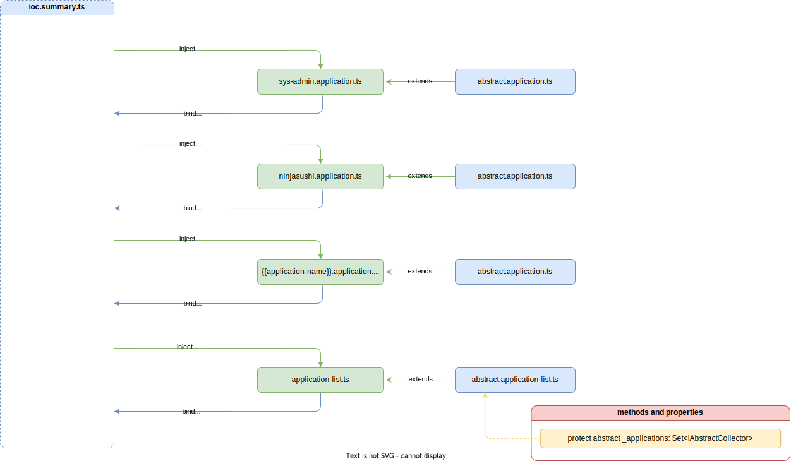

# Application List

Список застосунків `application list` є точкою входу до бізнес логіки серверних застосунків. Список не обмежується в кількості застосунків, які необхідно зареєструвати. 

> [!ATTENTION]
> Кожний список застосунків `application list` повинен успадковуватись від абстрактного застосунку `abstract application`, завдяки чому серверне ядро зможе отримати доступ до списку застосунків `abstract application` та пробігшись по дереву залежностей створити екземпляр результуючої бізнес-логіки.



При створені списку застосунків необхідно проініціалізувати `Set` колекцію. Ця колекція слугує для додавання, застосунків, які повинні ввійти в результуючу бізнес-логіку.

> [!ATTENTION]
> Реєстрація застосунків відбувається за рахунок `inject` відповідного застосунку.

Приклад реалізації конкретного списку застосунків `application list`: 

```typescript
import { inject, injectable } from 'inversify';
import NinjaSushiSymbols from '../ioc/ioc.ninjasushi.symbols';
import { AbstractApplicationList } from '@Vendor';

import { IApplication, IApplicationList } from '@VendorTypes';
import SystemAdminSymbols from '../ioc/ioc.system-admin.symbols';

@injectable()
class ApplicationList extends AbstractApplicationList implements IApplicationList {
  protected _applications: Set<IApplication>;

  constructor(
    @inject(SystemAdminSymbols.Application) private _sysAdmin: IApplication,
    @inject(NinjaSushiSymbols.Application) private _ninjaSushi: IApplication
  ) {
    super();
  }

  protected _setApplications() {
    this._applications = new Set<IApplication>();
    this._applications.add(this._sysAdmin);
    this._applications.add(this._ninjaSushi);
  }
}

export default ApplicationList;
```

Деталі реалізації абстрактного cписку застосунків `abstract application list` дивись [AbstractApplicationList](../server-platform/abstract-documents.md#application-list).
