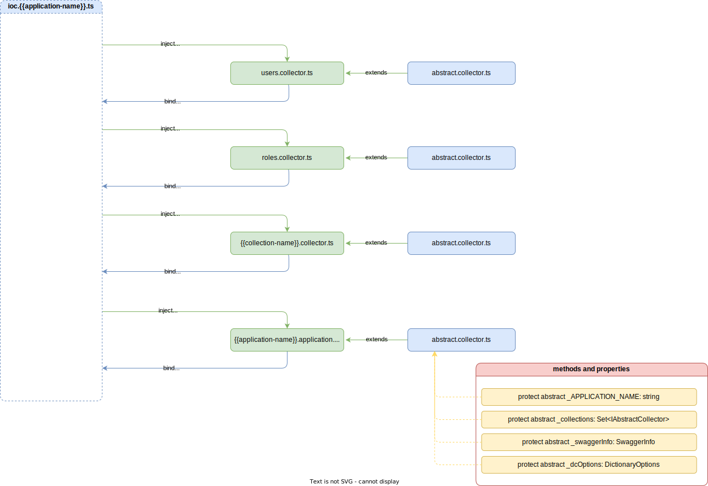

## Application

Застосунок `application` відповідає за реєстрацію колекцій. Кожний застосунок може складатись с десятків, а то і сотней колекцій, чат ботів та сторонніх модулів, які необхідні конкретному застосунку та не надаються серверним ядром. 

> [!ATTENTION]
> Кожний застосунок `application` повинен успадковуватись від абстрактного застосунку `abstract application`, завдяки чому застосунок буде включений в загальну схему бізнес-логіки.



При створені застосунку необхідно описати сам застосунок:
- `_APPLICATION_NAME` - вказати ім'я застосунку. Ім'я повинно бути унікальним в рамках всіх серверних застосунків.
- `_collections` - ініціалізувати `Set` колекцію бізнес колекцій, куди в подальшому необхідно буде додавати бізнес колекії, які описують відповідні домені області. 
- `_swaggerInfo` - описати загальну інформацію про застосунок, ця інформація в подальшому буде використана при генерації `Swagger` API документації. Загальна інформація складається з:
    - `title` - Заголовок API документації. Обов'язково.
    - `description` - Опис застосунку. Обов'язково.
    - `contact` - контакт, особи яка створила застосунок. Опціонально.
    - `version` - версія застосунку. Обов'язково.
- `_dcOptions` - опції словників, відповідає за опис мов, які підтримуються застосунком, та визначає основну мову, яка буде використовуватись за замовчуванням. ОПції складаються з:
    - `fallbackLng` - масив коротких позначень мов. Обов'язково.
    - `lng` - основна мова, яка буде використовуватись за замовчуванням. Обов'язково.


> [!NOTE]
> Реєстрація колекцій відбувається за рахунок `inject` колекціонера відповідної колекції (кожний колекціонер за аналогічним принципом реєструє всі документи колекції).

Приклад реалізації конкретного застосунку `application`: 

```typescript
import { inject, injectable } from 'inversify';
import ApplicationNames from '../../common/application.name';
import NinjaSushiSymbols from '../../ioc/ioc.ninjasushi.symbols';

import { IAbstractCollector, IApplication } from '@VendorTypes';
import { AbstractApplication } from '@Vendor';

@injectable()
class NinjaSushiApplication extends AbstractApplication implements IApplication {
  protected _APPLICATION_NAME = ApplicationNames.NINJA_SUSHI;
  protected _collections: Set<IAbstractCollector>;
  protected _swaggerInfo = {
    title: 'Ninja Sushi Test e-commerce Api',
    description: 'Application for test e-commerce shop',
    contact: 'test.user@gmail.com',
    version: '1.0.0',
  };
  protected _dcOptions = {
    fallbackLng: ['en', 'ru'],
    lng: 'en',
  };

  constructor(
    @inject(NinjaSushiSymbols.AuthCollector) private auth: IAbstractCollector,
    @inject(NinjaSushiSymbols.UserCollector) private user: IAbstractCollector
  ) {
    super();
  }

  protected _setCollections(): void {
    this._collections = new Set<IAbstractCollector>();
    this._collections.add(this.auth);
    this._collections.add(this.user);
  }
}

export default NinjaSushiApplication;
```

Деталі реалізації абстрактного застосунку `abstract application` дивись [AbstractApplication](../server-platform/abstract-documents.md#application).
