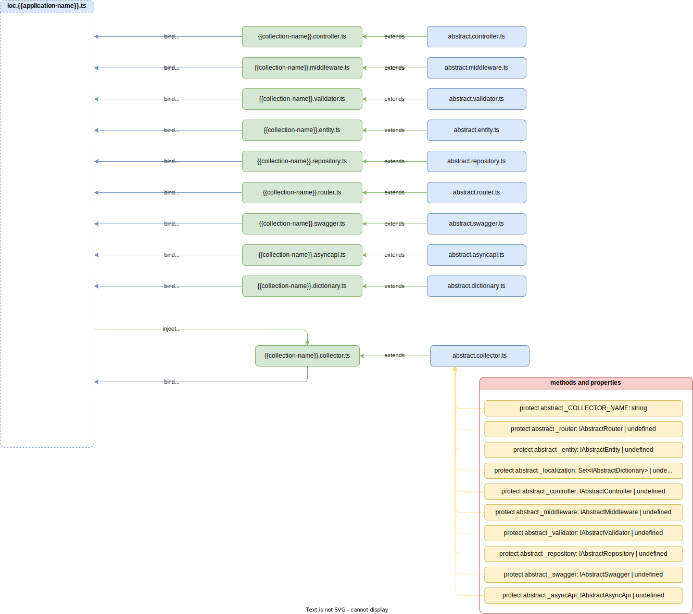

# Collector 

Документ колекціонер `collector` призначений для реєстрації всіх документів відповідної колекції, та реєстрації документів, які входять до цієї ж колекціїї. Кожний колекціонер повинен успадковуватись від абстрактного колекціонера `abstract collector`.

>[!ATTENTION]
> Якщо колекціонер не буде успадкований від абстрактного колекціонера, він не попаде в загальну бізнес-схему та не буде під'єднаний до серверного ядра, тобто колекція не буде працювати. Це створено навмисно, щоб кожний колекціонер був уніфікований від колекції до колекції, від застосунку до застосунку, від проекта до проекта.




При описі колекціонера, необхідно явно зазначити наявність або відсутність конкретного документа в колекції. Далі приклад приєднання та реєстрації окремих документів в колекціонері:

```typescript
import { inject, injectable } from 'inversify';
import CollectionNames from '../../../../common/collection.name';
import NinjaSushiSymbols from '../../../../ioc/ioc.ninjasushi.symbols';

import { AbstractCollector } from '@Vendor';
import { IAbstractCollector, IAbstractDictionary, IAbstractRouter } from '@VendorTypes';

import { IAuthValidator } from '@CollectionsTypes/ninjasushi/collections/auth/auth.validator';
import { IAuthController } from '@CollectionsTypes/ninjasushi/collections/auth/auth.controller';
import { IAuthMiddleware } from '@CollectionsTypes/ninjasushi/collections/auth/auth,middleware';
import { IAbstractSwagger } from '@CoreTypes/abstract-documents/abstracts.swagger';

@injectable()
class AuthCollector extends AbstractCollector implements IAbstractCollector {
  protected collector = CollectionNames.AUTH;
  protected localizations: Set<IAbstractDictionary>
  protected entity = undefined;
  protected repository = undefined;

  constructor(
    @inject(ninjaSushiSymbols.AuthController) protected controller: IAuthController,
    @inject(ninjaSushiSymbols.AuthMiddleware) protected middleware: IAuthMiddleware,
    @inject(ninjaSushiSymbols.AuthValidator) protected validator: IAuthValidator,
    @inject(ninjaSushiSymbols.AuthI10nEN) protected i10nEN: IAbstractDictionary,
    @inject(ninjaSushiSymbols.AuthI10nRu) protected i10nRU: IAbstractDictionary,
    @inject(ninjaSushiSymbols.AuthRouter) protected router: IAbstractRouter,
    @inject(ninjaSushiSymbols.AuthSwagger) protected swagger: IAbstractSwagger
  ) {
    super();

    this.localizations = new Set<IAbstractDictionary>();
    this.localizations.add(this.i10nEN);
    this.localizations.add(this.i10nRU);
  }
}

export default AuthCollector;
```

Деталі реалізації абстрактного колекціонера дивись [AbstractCollector](../server-platform/abstract-documents.md#collector)

