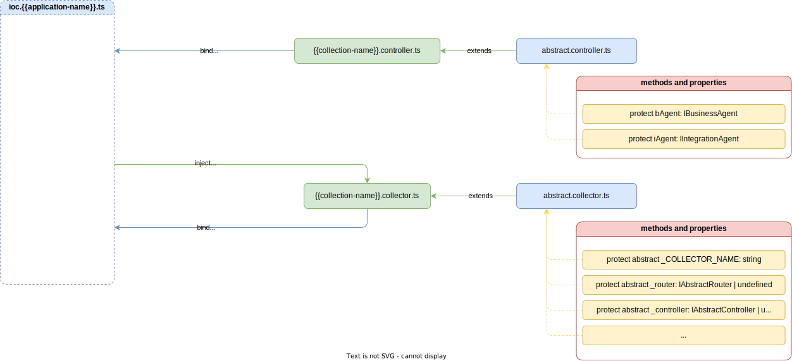

# Controller

Документ контролера `controller` відповідає за опис основних обробників маршрутів. Кожний маршрут може налічувати лише один основний обробник маршрутів.



>[!ATTENTION]
> Якщо контролер `controller` не буде успадкований від абстрактного контролера `abstract controller`, контролер не буде мати доступ до бізнес агента `bAgent` та агента інтеграцій `iAgent`, а отже не зможе використовувати абстрактний функціонал, який надається серверним ядром з коробки. 

Кожний основний обробник складається з 2 аргументів:
- `request` - об'єкт запиту. Складається з:
    - `url` - url запиту.
    - `body` - тіла запиту.
    - `params` - параметрів запиту.
    - `headers` - заголовків запиту.
    - `query` - параметрів url.
- `response` - об'єкт відповіді. Налічує методи:
    - `download` - запрошення на відвантаження файлу.
    - `send` - відправка HTTP відповіді.
    - `sendStatus` - відправка HTTP статусу.
    - `status` - визначає статус HTTP відповіді. Не є кінцевим методом HTTP відповіді.
    - та ін.


> [!ATTENTION]
> Кожний основний обробник повинен бути описаний як стрілочна функція, оскільки конкретний обробник не повинен мати ні стану, ні контексту, для можливості горизонтального масштабування всієї системи.


// необхідне посилання на тип response і request.


Серверне ядро, обробляє маршрути таким чином, що абстрактні аргументи `request` та `response` будуть адаптовані під заданий в конфігураційному файлі фреймворк. Коли створюється виклик необхідного маршруту, то ядро направляє його, на вже сформований та під'єднаний маршрут екземпляра цього фреймворка.

> [!NOTE]
> Рекомендується при створені основного обробника:
> - Зменшувати кількість запитів до бази даних шляхом опису максимальної кількості логіки в запиті.
> - Генерувати HTTP відповіді при створені виключень, коли це логічно доцільно - наприклад при перевірці паролю, який задається при вході в систему.

```typescript
import { inject, injectable } from 'inversify';
import { AbstractController, HttpCode, StatusMessage } from '@Vendor';
import { RequestRoutine, ResponseRoutine } from '@VendorTypes';

import {
  IAuthController,
  SignupDto,
} from '@CollectionsTypes/ninjasushi/collections/auth/auth.controller';
import { IUserRepository } from '@CollectionsTypes/ninjasushi/collections/user/user.service';
import NinjaSushiSymbols from '../../../../ioc/ioc.ninjasushi.symbols';

@injectable()
class AuthController extends AbstractController implements IAuthController {
  constructor(@inject(NinjaSushiSymbols.UserRepository) private userRepo: IUserRepository) {
    super();
  }

  public signup = async (
    req: RequestRoutine<{}, SignupDto>,
    res: ResponseRoutine
  ): Promise<void> => {
    try {
      const hashPassword = await this.bAgent.scrambler.hashedPassword(req.body.password);
      const { userId } = await this.userRepo.createUser(req.body, hashPassword);

      const token = this.bAgent.scrambler.createHash(userId);

      await this.userRepo.setUserRegisterToken(userId, token);
      this.bAgent.mailer.sendActivationLink(
        req.url.replace('/signup', '/activate/account'),
        token
      );

      return res.status(HttpCode.CREATED).json({
        status: StatusMessage.SUCCESS,
        data: {
          message: this.bAgent.i10n.t('auth.successSignup'),
        },
      });
    } catch (e) {
      this.bAgent.logger.error(e);
    }
  };

  public activateAccount = async (
    req: RequestRoutine<{ link: string }>,
    res: ResponseRoutine
  ): Promise<void> => {
    const { link } = req.params;
    try {
      const userId = await this.userRepo.findUserByRegisterToken(link);
      if (!userId) {
        return res.status(HttpCode.NOT_FOUND).json({
            status: StatusMessage.FAIL,
            message: this.bAgent.i10n.t('auth.emailNotFound')
        })
      }

      await this.userRepo.activateUser(userId);

      res.status(HttpCode.SUCCESS).json({
        status: StatusMessage.SUCCESS,
        data: {
          message: this.bAgent.i10n.t('auth.successActivateAccount'),
        },
      });
    } catch (e) {
      this.bAgent.logger.error(e);
    }
  };
}

export default AuthController;

```

Деталі реалізації абстрактного контролера `abstract controller` дивись [AbstractController](../server-platform/abstract-documents.md#controller).