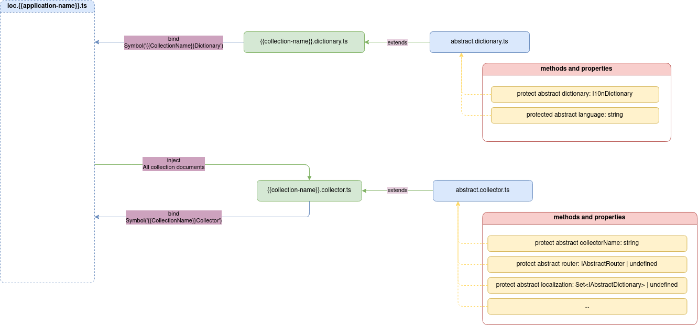

## Dictionary

Документ "словник" `dictionary` призначений для опису ресурсів на відповідній мові. Ресурси представляють собою фрази, які відповідний маршрут може надавати об'єкту взаємодіїї в відповідь. Наприклад повідомлення про успішну реєстрацію, тощо. 

> [!NOTE]
> Кожний словник повинен описувати тільки ресурси своєї колекції на відповідній мові, але при цьому, якщо один ресурс необхідно використовувати в іншій колекції, то при створені обробників необхідно просто зазначити ключ, який вже був зазначений в колекції, де створений ресурс.

Кожний словник `dictionary` повинен успадковуватись від абстрактного словника `abstract dictionary`, завдяки чому словник декларативно буде доданий в загальну схему всіх ресурсів.

> [!ATTENTION]
> Якщо словник `dictionary` не буде успадковуватись від абстрактного словника `abstract dictionary`, то словник не буде доданий в результуючу схему всіх ресурсів, а отже не зможе бути задіяний при роботі з бізнес-логікою. 



Словників може бути стільки, скільки потрібно для конкретної бізнес-логіки. Для цього кожний словник необхідно помічати відповідною мовою та зазначати цю мову в полі `_language`.

Шаблон створення назви мови конкретної колекції:

```
{{collection-name}}.i10n.{{language-name}}.ts
```

Приклад створення назви для колекції авторизації `auth`:

```
auth.i10n.en.ts
auth.i10n.uk.ts
```

> [!ATTENTION]
> Серверне ядро при створені словників використовує бібліотеку `i18next`. Для деталнього розуміння роботи бібліотеки `i18next` дивись [Документація i18next](https://www.i18next.com/)

Кожний словник підтримує:
- Вкладеність полів в об'єкті, а доступ до цих полів здійснюється строкою, кожний вхідний ключ перелічуючи через крапку. Наприклад для об'єкта `{'auth': {'email': 'not found'}}` отримати доступ до значення можливо так: `auth.email`.
- Створення динамічний значень, тобто ресурсів, в поля яких є можливість вкласти конкретне динамічне значення. Деталі дивись [Створення ресурсів з динамічними полям](https://www.i18next.com/translation-function/nesting)

Приклад створення словника:

```typescript
import { injectable } from 'inversify';

import { AbstractDictionary } from '@Vendor';
import { IAbstractDictionary } from '@VendorTypes';

@injectable()
class AuthI10nEn extends AbstractDictionary implements IAbstractDictionary {
  protected _language = 'en';

  protected get _dictionary() {
    return {
      auth: {
        email: {
          exists: 'User with this email has already exists',
          notFound: "User with email '{{email}}' not found",
        },
        incorrectActivationLink: 'Invalid activation link. Try signup again',
        success: {
          activateAccount: 'Account successfully activated',
          signup: 'Registration completed successfully',
        },
        token: {
          accessExpired: 'Access token expired',
          refreshExpired: 'Refresh token expired. Please login in your account again',
        },
        incorrectEmailOrPassword: 'Incorrect email or password',
        passwordNotMatch: 'Passwords do not match',
        emptyRequiredField:
          "One or more required fields are missing. Required next fields: '{{fields}}'",
        unauthorized: 'You are not authorized. Log in first',
      },
    };
  }
}

export default AuthI10nEn;
```

Деталі реалізації абстрактного словника `abstract dictionary` дивись [AbstractDictionary](../server-platform/abstract-documents.md#dictionary).