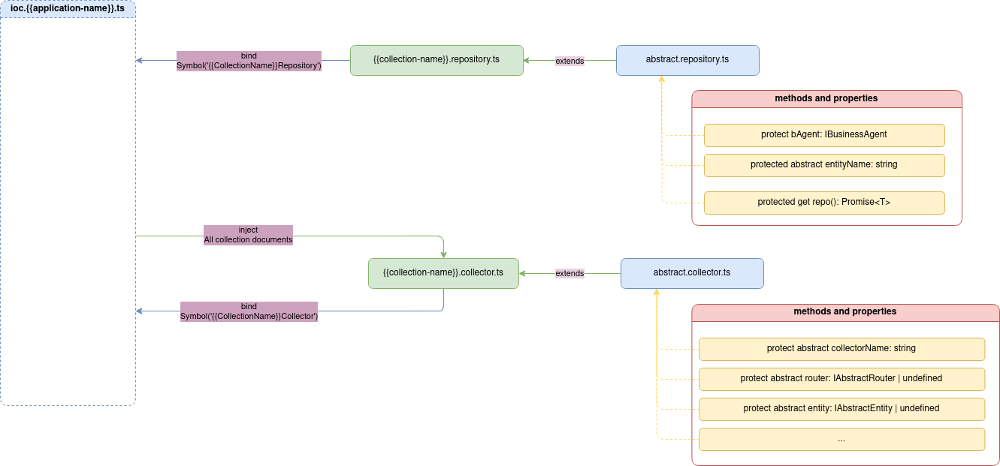

# Repository

Документ репозиторій `repository` приначений для створення запитів до конкретної схеми сутності в базі даних `entity`. Кожний колекціонер повинен успадковуватись від абстрактного репозиторія `abstract repository`, завдяки чому, репозиторій матиме доступ до відповідної схеми сутності `entity`.

>[!ATTENTION]
> Якщо репозиторій `repository` не буде успадковуватись від абстрактного репозиторія `abstract repository`, то запити не зможуть звертатись до відповідної схеми сутності `entity`.



При описі репозиторія необхідно явно зазначити ідентичну назву схеми сутності `entity`, яка була визначена при створені документа схеми сутності. 

> [!NOTE]
> Серверне ядро інкапсулює в собі роботу з `TypeORM`, це означає, що опис та реалізація запитів ідентична синтаксису та використанню репозиторіїв як в `TypeORM`. 
> Для детального розуміння бібліотеки `TypeORM` дивись [Документація TypeORM](https://typeorm.io/)

Для більш безпечної обробки будь-яких запитів, які пов'язані з виборкою даних бажано повертати або саму виборку або `null`, завдяки чому в документі контролера `controller` (де використовуються готові методи з відповідного репозиторія `repository`) необхідно явно обробити випадок, коли вибірка прийде пуста.


Кожний репозиторій `repository` підтримує 3 типи будівельників запитів `query builders`:
- `repo` - надає репозиторій класичного вигляду в `TypeORM`. Деталі дивись [Робота з репозиторіями в TypeORM](https://typeorm.io/working-with-repository).
- `builder` - надає будівельник запитів `query builder` класичного вигляду в `TypeORM`. Деталі дивись [Робота з будівельниками запитів в TypeORM](https://typeorm.io/select-query-builder).
- `query` - надає можливість створювати власні запити в строковому режимі. Деталі дивись [Створення строкових запитів в TypeORM](https://typeorm.io/entity-manager-api).

Окремо репозиторії підтримують транзакції:
- `transactions` - створює транзакцію класичного вигляду в `TypeORM`. Деталі дивись [Створення транзакцій в TypeORM](https://typeorm.io/transactions).


> [!ATTENTION]
> Доступ до будівельників запитів та транзакцій відбувається через `this`, оскільки вони надаються абстрактним репозиторіям `abstract repository` в залежності від назви схеми сутності таблиці в базі даних `entity`.

Приклад реалізації репозиторія `repository` з використанням репозиторія `repo`:


```typescript
import { injectable } from 'inversify';
import EntityName from '../../../../common/entity.name';

import { AbstractRepository } from '@Vendor';

import { IUserEntity } from '@CollectionsTypes/ninjasushi/collections/user/user.entity';
import { SignupDto } from '@CollectionsTypes/ninjasushi/collections/auth/auth.controller';
import { IUserRepository } from '@CollectionsTypes/ninjasushi/collections/user/user.service';

@injectable()
class UserRepository extends AbstractRepository<IUserEntity> implements IUserRepository {
  protected entityName = EntityName.USER;

  constructor() {
    super();
  }

  public async findUserById(id: string): Promise<IUserEntity | null> {
    const user = await this.repo.findOne({
      where: {
        userId: id,
      },
    });

    if (!user) {
      return null;
    }

    return user;
  }

  public async findUserByRegisterToken(token: string): Promise<string | null> {
    const user = await this.repo.findOne({
      where: {
        registerToken: token,
      },
    });

    if (!user) {
      return null;
    }

    return user.userId;
  }
}

export default UserRepository;
```

Деталі реалізації абстрактного репозиторія `abstract repository` дивись [AbstractRepository](../server-platform/abstract-documents.md#repository)