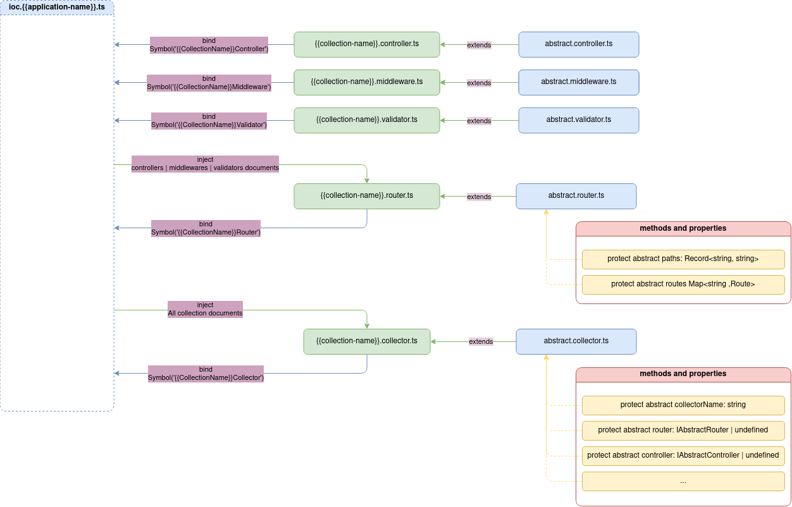

# Router

Документ маршрутизатора відповідає за опису маршрутів конкретної колекції.

Загальний маршрут має наступний вигляд:

```
{{protocol}}://{{host}}:{{port}}/{{applicaion-name}}/{{collection-name}}/{{action-name}}
```

де:
-  `protocol` - Перемінна оточення. Задається в конфігураційному файлі `transport.json`.
- `host` - Перемінна оточення. Задається в конфігураційному файлі `transport.json`.
- `port` - Перемінна оточення. Задається в конфігураційному файлі `transport.json`.
- `application-name` - Параметр. Визначається за назвою застосунку.
- `collection-name` - Параметр. Визначається за назвою колекції.
- `action-name` - Параметр. Визначається за назвою маршруту.

Наприклад маршрут реєстрації нового користувача в застосунку "Системний адміністратор":

```
http://localhost:3000/SystemAdministrator/User/v1/signup
```

> [!ATTENTION]
> Рекомендується створювати назви маршрутів з префіксом v1, наприклад `v1/signup`, де `v1` префікс, `signup` маршрут. Таким чином може бути створена версійність конкретного маршруту. 

Маршрутизатор `Router` повинен успадковуватись від абстрактного маршрутизатора `abstract router`.

>[!ATTENTION]
> Якщо маршрутизатор `router` не буде успадкований від абстрактного маршрутизатора `abstract router`, маршрути не попадуть в результуючу бізнес-схему та не зможуть бути використані. Це створено навмисно, щоб кожний колекціонер був уніфікований від колекції до колекції, від застосунку до застосунку, від проекта до проекта.



При описі маршрутизатора `router` мінімальний набір даних маршруту складається з:
- `path` - шляху маршруту.
- `handler` - основного обробника, який необхідно створити в документі `Controller`.

>[!ATTENTION]
> Рекомендується шляхи маршруту виносити в окремий файл `{{collection-name}}.router.path.ts` - наприклад `user.router.path.ts`, оскільки маршрути можуть бути використані при описі документації в документах `Swagger` чи `AsynApi`. Таким чином, при розрозбці запобігається створення орфографічних помилок при описі маршрутів. 

Кожний маршрут може такой налічувати:
- Схему валідації - якщо маршрут передбачає передачу тіла запиту. Схеми валідації описуються в документі валідатора `validator`.
- Проміжні обробники - якщо маршрут передбачає проміжні обробники `middleware`. Проміжні обробники повинні описуватись в документі проміжного обробника `middleware`.

```typescript
import { inject, injectable } from 'inversify';
import ninjaSushiSymbols from '../../../../ioc/ioc.ninjasushi.symbols';

import { AbstractRouter } from '@Vendor';
import { IAbstractRouter } from '@VendorTypes';

import { IAuthController } from '@CollectionsTypes/ninjasushi/collections/auth/auth.controller';
import { IAuthMiddleware } from '@CollectionsTypes/ninjasushi/collections/auth/auth,middleware';
import { IAuthValidator } from '@CollectionsTypes/ninjasushi/collections/auth/auth.validator';
import AuthRouterPath from './auth.router.path';
import { CollectionRoute } from '@Core/abstract-documents/abstract.router';

@injectable()
class AuthRouter extends AbstractRouter implements IAbstractRouter {
  protected paths = AuthRouterPath;
  protected route: Map<string, CollectionRoute>

  constructor(
    @inject(NinjaSushiSymbols.AuthMiddleware) private authMiddleware: IAuthMiddleware,
    @inject(NinjaSushiSymbols.AuthController) private authController: IAuthController,
    @inject(NinjaSushiSymbols.AuthValidator) private authValidator: IAuthValidator
  ) {
    super();
  }

  protected addRoutes() {
    this.routes = new Map<string, CollectionRoute>()
    this.routes.set(this.paths.SIGNUP, {
      method: 'post',
      handler: this.authController.signup,
      preValidateHandler: this.authValidator.signup,
    });
    this.routes.set(this.paths.LOGIN, {
      method: 'post',
      handler: this.authController.login,
    });
    this.routes.set(this.paths.LOGOUT, {
      method: 'get',
      handler: this.authController.logout,
    });
  }
}

export default AuthRouter;
```

Деталі реалізації абстрактного маршрутизатора дивись [AbstractRouter](../server-platform/abstract-documents.md#router).