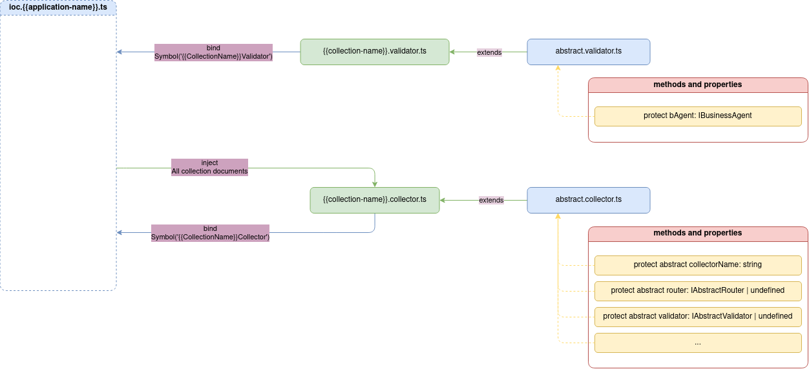

# Validator

Документ валідатор `validator` відповідає за опис схем валідацій. Схеми валідації використовуються для валідації вхідних даних, які потенційно, можуть потребувати той чи інший основний обробник маршруту. Кожний валідатор `validator` повинен унаслідуватись від абстрактного валідатора `abstract validator`, завдяки чому, валідатор має доступ до самого об'єкту валідації, який валідацію конкретного поля

> [!ATTENTION]
> Якщо валідатор `validator` не буде успадковуватись від абстрактного валідатора `abstract validator`, то валідатор не зможе використовувати зашиті методи формування схем валідації, а отже буде неможливо створювати схеми валідації.



Схеми валідації також використовуються для опису тіла запиту, при описі `Swagger` API документації, яка створюється в документаторі `swagger`. 

> [!NOTE]
> Серверне ядро при обробці схем валідації використовує бібліотеку `joi`. 
> Для детального розуміння роботи бібліотеки `joi` дивись [Документація Joi](https://joi.dev/api/)

Кожний валідатор `validator` завдяки абстрактному валідатору має доступ до:
- Об'єкта валідації `validator`, який надається агентом бізнес логіки `business logic agent`.
- Метода перевірки валідації `getValidationResult`, який приймає реальні вхідні дані, та описану схему валідації, а результатом повертає або масив помилок валідації або `null`.

Окремою можливістю валідатора є отримання готових Swagger API схем валідацій `SwaggerSchema` завдяки методу `getSchema`.

Приклад реалізації валідатора `validator`, де описані:
- Схеми валідації.
- Методи валідації вхідних полів.
- Методи для отримання готових `Swagger` схем.

```typescript
import { AbstractValidator } from '@Vendor';
import { IBusinessAgent, ValidateSchema, ValidationResult } from '@VendorTypes';

import { IAuthValidator } from '@CollectionsTypes/ninjasushi/collections/auth/auth.validator';
import { IUserRepository } from '@CollectionsTypes/ninjasushi/collections/user/user.service';
import { LoginDto, SignupDto } from '@CollectionsTypes/ninjasushi/collections/auth/auth.controller';
import { SwaggerSchema } from '@CoreTypes/abstract-documents/abstracts.swagger';

@injectable()
class AuthValidator extends AbstractValidator implements IAuthValidator {
  protected _bAgent: IBusinessAgent;

  protected readonly _signupSchema = {
    email: this._bAgent.validator.string().email().min(3).max(520).required(),
    firstName: this._bAgent.validator.string(),
    lastName: this._bAgent.validator.string(),
    password: this._bAgent.validator.string(),
    confirmPassword: this._bAgent.validator.string(),
  };

  protected readonly _loginSchema: ValidateSchema<LoginDto> = {
    email: this._bAgent.validator.string().email().min(3).max(520).required(),
    password: this._bAgent.validator.string().min(3).max(255).required(),
  };

  constructor(@inject(NinjaSushiSymbols.UserRepository) private _userRepo: IUserRepository) {
    super();
  }

  public signup = (body: SignupDto): ValidationResult => {
    return this.getValidationResult<SignupDto>(this._signupSchema, body);
  };

  public get SignupSchema(): SwaggerSchema {
    return this.getSchema<SignupDto>(this._signupSchema);
  }

  public get LoginSchema(): SwaggerSchema {
    return this.getSchema<LoginDto>(this._loginSchema);
  }
}

export default AuthValidator;
```

Деталі реалізації абстрактного валідатора `abstract validator` дивись [AbstractValidator](../server-platform/abstract-documents.md#validator).