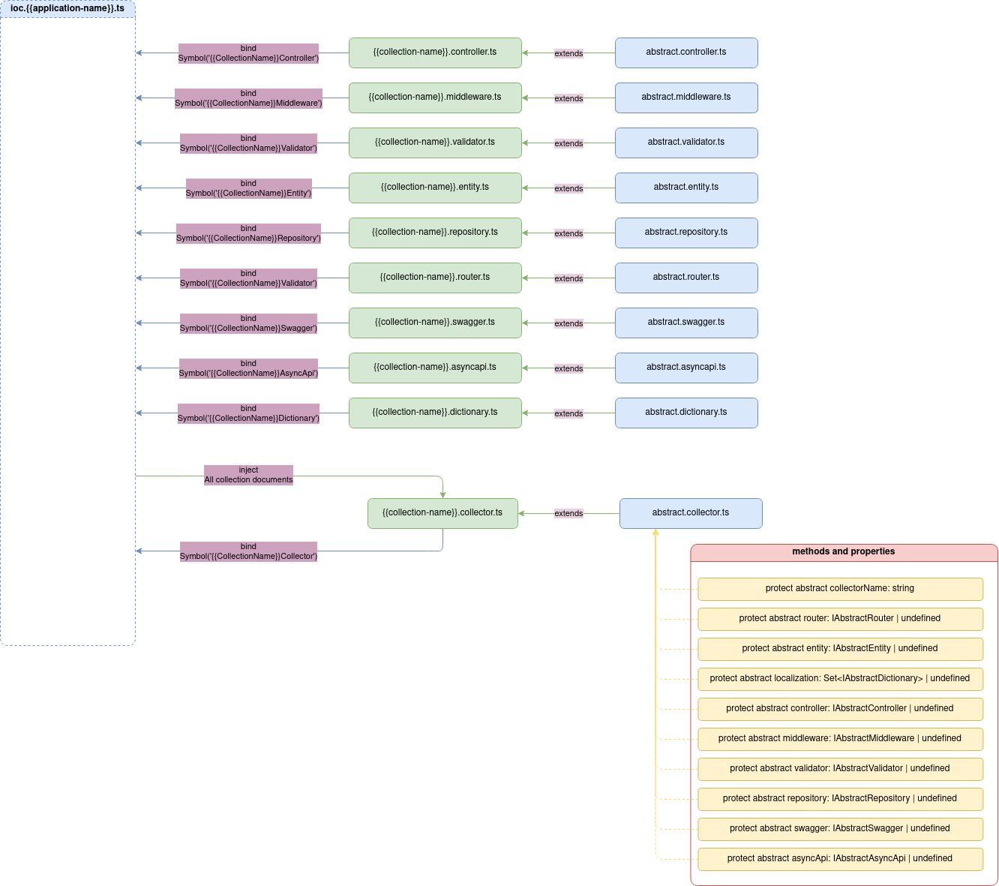

# Абстрактні документи

Кожен документ бізнес-логіки повинен наслідувати відповідний абстрактний документ. Абстрактні документи декларують властивості, які необхідно описати та методи, які необхідно створити. 

| Документ | Призначення | Функціонал, який необхідно задати |
| :------: | :---------: | :--------------- |
| `application-list` | Реєстрація серверних застосунків | - |
| `application` | Реєстрація колекцій до застосунку | - |
| `collector` | Реєстрація документів до колекції | - Визначити кожний з документів (який потенційно може входити до колекції) - присвоїти конкретний документ або присвоїти `undefined`.   - Визначити назву колекціонера `collector`.   - Створити `Set` колекцію, при необхідно створення словників мов. |
| `router` | Реєстрація маршрутів | - Визначити шляхи маршрутів.   - Ініціалізувати `Set` колекцію для створення повноцінного опису маршрутів. |
| `controller` | Реєстрація основних обробників | - |
| `middleware` | Реєстрація проміжних обробників | - |
| `repository` | Опис обробників запитів до бази даних | - Визначити назву сутності таблиці `entity`. |
| `entity` | Опис схеми сутності таблиці в базі даних | - Визначити назву сутності таблиці `entity`.   - Визначити схему сутності таблиці |
| `dictionary` | Опис словника конкретної мови колекції | - Визначити словник, який складається з ключа та перекладу.   - Описати мову словника |
| `swagger` | Опис Swagger документації API колекції | - Визначити тег колекції.   - Визначити опис маршрутів |
| `asyncapi` | Опис AsyncApi документації API колекції | - Визначити тег колекції.   - Визначити опис подій |
| `validator` | Опис схем валідації колекції | - |

Абстрактні документи, декларативно записують функціонал бізнес-логіки до загальної схеми, а також надають функціонал по роботі з агентами.

| Документ | Функціонал, який необхідно задати |
| :------: | :--------------- |
| `application-list` | - |
| `application` | - |
| `collector` | - |
| `router` | - агент базових операцій `base operations`. |
| `controller` | - агент бізнес-логіки `business logic agent`.   - агент інтеграцій `integration agent`.   - агент базових операцій `base operations`. |
| `middleware` | - агент бізнес-логіки `business logic agent`.   - агент інтеграцій `integration agent`.   - агент базових операцій `base operations`. |
| `repository` | - агент базових операцій `base operations`. |
| `entity` | - агент базових операцій `base operations`. |
| `dictionary` | - агент базових операцій `base operations`. |
| `swagger` | - агент базових операцій `base operations`. |
| `asyncapi` | - агент базових операцій `base operations`. |
| `validator` | - агент бізнес-логіки `business logic agent`.   - агент базових операцій `base operations`. |

## Application list

<!-- Бізнес-логіка будь-яка середньго та вище продукту складається з декількох северних застосунків. Базові вимоги до такого продукту є його моніторинг та підтримка. Поділ на публічний застосунок, та створення так званих АРМів (автоматизованих робочих місць). Наприклад:
- Малий бізнес, який виробляє суші та здійснює доставку, для достатньої автоматизації повинен мати:
    - системний застосунок, для моніторингу та підтримки системи.
    - застосунок бізнес адміністратора або робочого місця оператора приймання замовлень для створення замовлень, обробки замовлень, формуння цін та ін.
    - застосунок замовлень, завдяки якому пересічні користувачі подають заявки на замовлення суш, бачать акції, мають власні профілі та ін.

- Середній бізнес вже може мати мережу ресторанів суш або мати велику систему доставки, що для достатньої автоматизації, потребує ще й:
    - застосунок АРМ кур'єра для побудови маршрутів та динамічного розуміння керування замовленнями.
    - застосунок закупівель продуктів та ін.

Таким чином починаючи від малого бізнеса і продовжуючи його ростом - росте і кількість застосунків, які необхідні для достатньої автоматизації бізнесу. -->

Документ список застосунків `application-list` є реєстром таких застосунків. Для цього необхідно підключити відповідний застосунок.

## Application

Кожний застосунок 

## Collector 

## Router

## Controller

## Middleware

## Repository

## Entity

## Dictionary

## Swagger

## AsyncApi

## Validator

