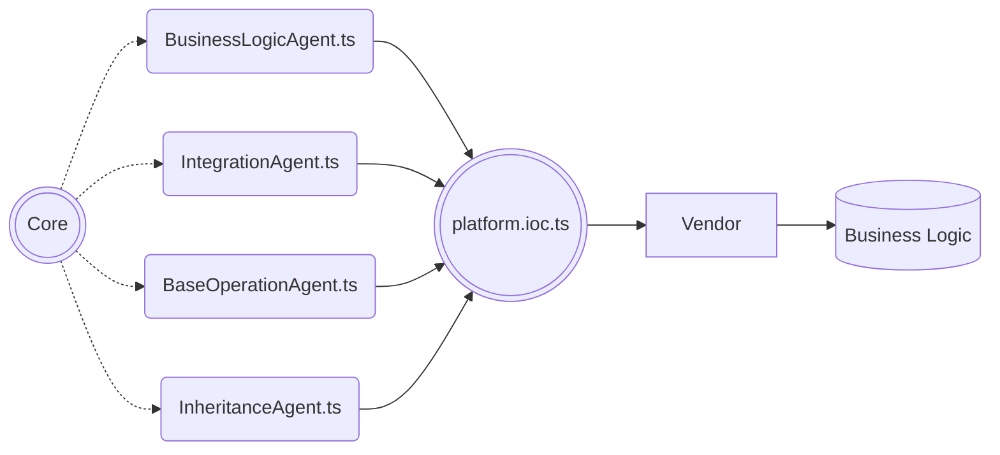

## Загальний опис {docsify-ignore}

Платформа представляє собою живий організм, який змінюється та розвивається,
а реалізовані застосунки, які працюють в робочому середовищі та потребують
підтримки напроти – потребують стабільності в своєму розвитку.   
З часом кількість застосунків які працюють в робочому середовищі постійно збільшується, це означає, що зміни,
які рушать минулі контракти між ядром та сервером – можуть порушити роботу не одного десятка застосунків,
які потребують підтримки, та кожний в свій час повинен бути перейти на нову версії серверної платформи.
З ціллю недопускання таких порушень створюється проміжний інтерфейс між ядром та бізнес-логікою.    

Так, кожний застосунок має лише дві залежності:
-	відповідні агенти – проміжні інтерфейси, які надають функціонал ядра.
-	типи, які описують контракти – надаються через один файл з типізацією.

 

Кожен агент надає абстрактний функціонал згідно його назви та призначення:
- Агент бізнес логіки `BusinessLogicAgent` - надає функціонал сервісів та провайдерів.
- Агент інтеграцій `IntegrationAgent` - надає функціонал взаємодії з зовнішніми системами, підсистемами чи сервісами.
- Агент базових операцій `BaseOperationAgent` - надає функціонал базових операцій.
- Агент наслідування `InheritanceAgent` - надає класи (не екземпляри) для можливості наслідування від них документів колекцій.

> [!NOTE]
> Кожен агент налічує гетери, які описують собою належність тому чи іншому сервісу, інтеграції та ін. Таким чином при використані агентів в документах бізнес-логіки
є чітке розуміння до якої абстракції відноситься той чи інший функціонал.

## Агент бізнес-логіки