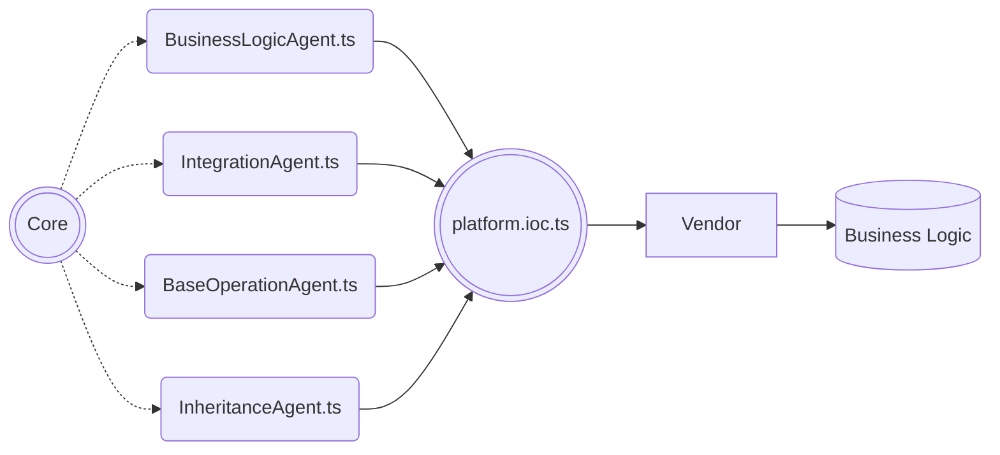
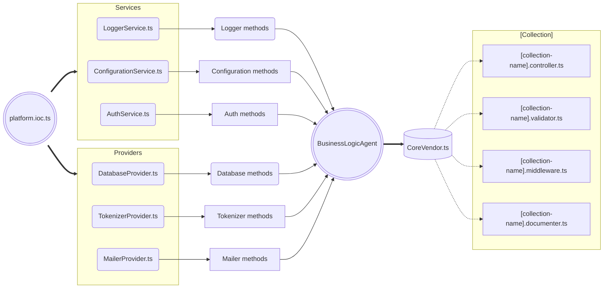

## Загальний опис {docsify-ignore}

Платформа представляє собою живий організм, який змінюється та розвивається,
а реалізовані застосунки, які працюють в робочому середовищі та потребують
підтримки напроти – потребують стабільності в своєму розвитку. <br/><br/>
З часом кількість застосунків які працюють в робочому середовищі постійно збільшується, це означає, що зміни,
які рушать минулі контракти між ядром та сервером – можуть порушити роботу не одного десятка застосунків,
які потребують підтримки, та кожний в свій час повинен бути перейти на нову версії серверної платформи.
З ціллю недопускання таких порушень створюється проміжний інтерфейс між ядром та бізнес-логікою. <br/> <br/>

Так, кожний застосунок має лише дві залежності:
-	відповідні агенти – проміжні інтерфейси, які надають функціонал ядра.
-	типи, які описують контракти – надаються через один файл з типізацією.

<br/>



Кожен агент надає абстрактний функціонал згідно його назви та призначення:
- Агент бізнес логіки `BusinessLogicAgent` - надає функціонал сервісів та провайдерів.
- Агент інтеграцій `IntegrationAgent` - надає функціонал взаємодії з зовнішніми системами, підсистемами чи сервісами.
- Агент базових операцій `BaseOperationAgent` - надає функціонал базових операцій.
- Агент наслідування `InheritanceAgent` - надає класи (не екземпляри) для можливості наслідування від них документів колекцій.

> [!NOTE]
> Кожен агент налічує гетери, які описують собою належність тому чи іншому сервісу, інтеграції та ін. Таким чином при використані агентів в документах бізнес-логіки
є чітке розуміння до якої абстракції відноситься той чи інший функціонал.

## Агент бізнес-логіки

Агент бізнес-логіки `BusinessLogicAgent` надає функціонал сервісів та провайдерів. 
Агент має додаткові абстракцію в вигляді гетеру, який має назву відповідного сервісу чи 
провайдера, що спрощує розуміння приналежності конкретного методу до конкретної сутності ядра.

```typescript
@injectable()
class BusinessLogicAgent implements IBusinessLogicAgent {

    constructor(
        @inject(CoreSymbols.ErrorProvider) private errorProvider: IErrorProvider,
        @inject(CoreSymbols.LoggerService) private loggerService: ILoggerService,

        @inject(CoreSymbols.DatabaseProvider) private dbProvider: IDatabaseProvider,
        @inject(CoreSymbols.MailerProvider) private mailerProvider: IMailerProvider
        ...
    ) {}

    public get tokenizerProvider() {
        return {
            getToken: (userId: string, type?: 'access' | 'refresh') => this.tokenizerProvider.getToken(userId, type),
            verifyToken: (token: string) => this.tokenizerProvider.verifyToken(token),
            getExpiredAt: () => this.tokenizerProvider.getExpiredAt()
        }
    }

    public get dbProvider() {
        return {
            getRepo: <T extends Record<string, unknown>>(entityName: string) => this.dbProvider.getRepository<T>(entityName)
        }
    }

    public get loggerService() {
        return {
            info: (message: string) => this.loggerService.info(message),
            error: (error: any) => this.loggerService.error(error)
        }
    }
    
    ...
}

export default BusinessLogicAgent
```

Агент надає системний функціонал, що в 90% випадків використовується для створення схем валідації,
проміжних та основних обробників, документації API конкретної колекції, 
а також при потребі додавання готових проміжних чи основних обробників при створені маршрутизації, 
наприклад обробник базової реєстрації через логін або пароль.


**Повна схема просування функціоналу сервісів та провайдерів до відповідного документу будь-якої коллекції:**



<br/>

> [!NOTE]
> Деталі використання агентів в колекціях та документах дивіться ["Використання агентів в колекціях та документах"](server-platform/business-logic.md)


## Агент інтеграцій

Агент інтеграцій `IntegrationAgent` надає функціонал зовнішніх інтеграцій. Агент має додаткові абстракції в вигляді 
гетерів, який має назву відповідної інтеграції, що спрощує розуміння принадлежності конкретного метода до конкретної 
інтеграції.

Зовнішніми інтеграціями можуть виступати як прості сервіси авторизації так і великі платформи для створення окремих 
застосунків взаємодії, наприклад `Telegram` або `Firebase`.

Оскільки інтеграції зазвичай супроводжуються даними ідентифікації системи, 
які можуть бути вказані в договорі, або є згенерованими даними доступу для взаємодії між системи,
то такі дані зберігаються в конфігураційних файлах.
