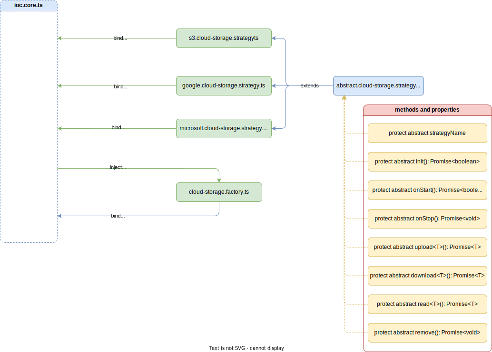
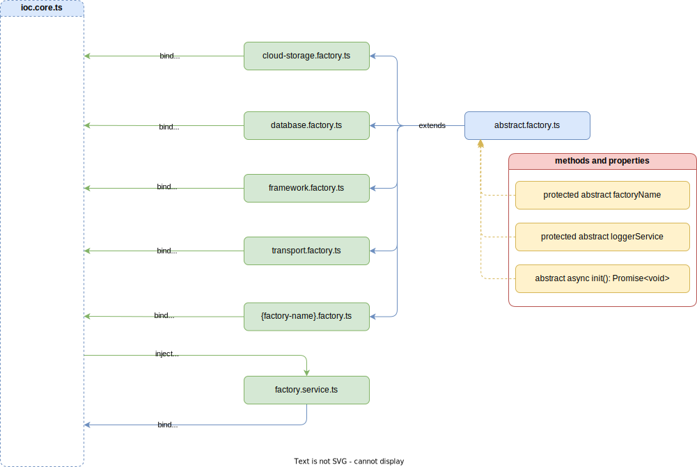
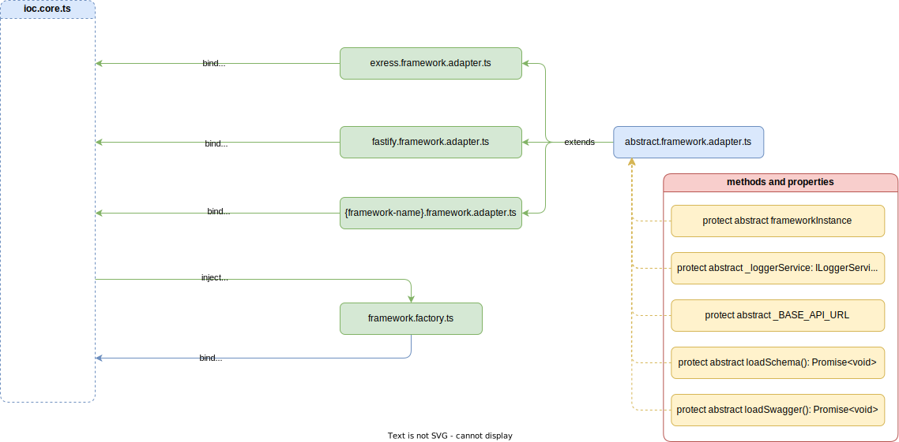
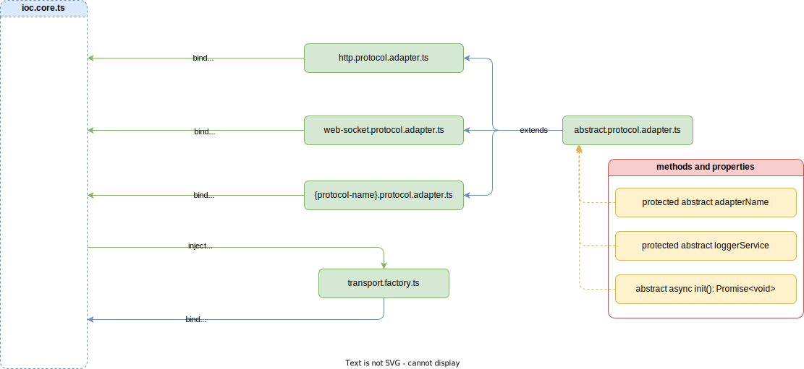

## CloudStorageFactory

Фабрика хмарних сховищ виходячи з конфігурації - створює з'єднання з відповідних хмарним сховищем, та повертає езкемпляр взаємодії з цим сховищем. Кожне хмарне сховище представляє собою стратегию з'єднання з цим сховищем.

Оскільки кожне хмарне сховище реалізовує однаковий інтерфейс, а самі сховища виконують одну і ту ж задачу, то клас конкретного хмарного сховища являє собою стратегию. 

Кожна стратегия хмарного сховища наслідує абстрактну стратегію хмарного сховища. Завдяки цьому опис нових стратегій хмарних сховищ є декларативним, оскільки абстрактна стратегія диктує предметній стратегії, які методи необхідно реалізувати та які властивості необхідно описати.

### Архітектура взаємодії

Фабрика хмарних сховищ та стратегії входять до складу контейнера інверсії залежностей ядра серверу. При цьому, як і кінцевий користувач так і прикладний програміст не знають, та не управляють напряму роботою фабрики хмарних сховищ або конкретною стратегією. Програмісту бізнес-логіки надається функціонал по завантаженню або відвантаженню конкретних файлів.

При створені функціоналу завантаження або відвантаження конкретних файлів, ці файли завантажуються в хмарне сховище, а в системну таблицю записується опис файлу, посилання на його місце розташування в сховищі. На вихід ж повертається унікальний ідентифікатор запису файла в таблиці, таким чином бізнес-логіка оперує лише унікальними ідентифікаторами записів в таблицях, а не унікальними ідентифікаторами самих файлів. 

<>

### Змінні оточення

При роботі фабрики хмарних сховищ та стратегій використовуються змінні оточення, які описуються приватні ключі, токени доступу та ін. Повний перелік з врахуванням стратегій:

| Змінна | Тип | Модуль | Належність | За замовчуванням | Опис |
| :----: | :--: | :---: | :--------: | :--------------: | :--- |
| STRATEGIES.CLOUD_STORAGE.AWS.ENABLE | Boolean | AwsCloudStorageStrategy | Strategy | false | Вмикає підключення хмарного сховища типу `S3` | 
| STRATEGIES.CLOUD_STORAGE.AWS.ACCESS_KEY_ID | String | AwsCloudStorageStrategy | Strategy | - | Унікальний ідентифікатор ключа доступу до аккаунту `AWS` | 
| STRATEGIES.CLOUD_STORAGE.AWS.SECRET_ACCESS_KEY | String | AwsCloudStorageStrategy | Strategy | - | Cекретний ключ доступу до аккаунту `AWS` | 
| STRATEGIES.CLOUD_STORAGE.AWS.BUCKET_NAME | String | AwsCloudStorageStrategy | Strategy | - | Назва `S3` хмарного сховища |
| STRATEGIES.CLOUD_STORAGE.GOOGLE_CLOUD.ENABLE | Boolean | GoogleCloudStorageStrategy | Strategy | - | Вмикає підключення хмарного сховища типу `Google Cloud Storage` | 
| STRATEGIES.CLOUD_STORAGE.MICROSOFT_BLOBS.ENABLE | Boolean | MicrosoftBlobsStorageStrategy | Strategy | - | Вмикає підключення хмарного сховища типу `Microsoft BlobsW Storage` | 
