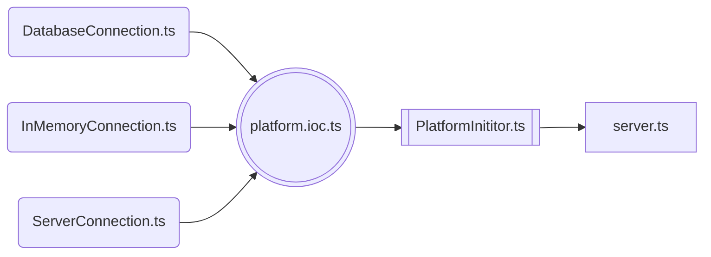

## Ініціалізація серверної платформи

Модуль `server.ts` є точкою входу до серверної платформи. В ньому з контейнера інверсіх залежностей, дістається екземпляр
класу `ServerInitor`. <br/>
У якого є два методи:
- `start` - створює з'єднання з елементами платформи 
- `stop` - зупиняє з'єднання з елементами платформи

Та які реалізовані наступним чином:

```typescript
const server = ioc.get<IServerInitor>(CoreSymbols.ServerInitor)

const start = async () => {
    await server.start()
}

const stop = async () => {
    await server.stop()
    process.removeAllListeners()
    process.exit(0)
}

process.on('SIGTERM', stop)
process.on('SIGINT', stop)
process.on('SIGHUP', stop)
process.on("uncaughtException", (e) => {
    console.error(e)
    server.stop().then(() => {
        process.exit(1);
    });
});

...

start().catch((e) => {
    console.log("Server end with error: ", e);
});
```
<br/>

Запуск серверної платформи складається з ініціалізації елементів платформи. Зупинка платформи може виникнути в процесі виникнення
помилок програми в ході створення відповідного сигналу, а якщо ні один обробник не відловив помилку та не здійснив виключення, то на цей
рахунок приймає роль `uncaughtException` тип події.

## Елементи системи

Найнижчий рівень платформи влаштований з послідовно підключених елементів системи. 
В цій послідовності, при ініціалізації платформи, будуть запущені чи зупинені елементи системи. 
Якщо елементи були вибудовані в одному порядку для їх ініціалізації, то відключення відбувається рівно в протилежному порядку. <br/><br/>
Елементами платформи на момент першого релізу є:
-  З’єднувач з базою даних `DatabaseConnection` – відповідає за запуск та закриття пулу з’єднань з базою даних.
-  З’єднувач з InMemory сховищем `InMemoryConnection` – відповідає за запуск та закриття з’єднання з InMemory сховищем.
-  З’єднувач з сервером `ServerConnection` – відповідає за запуск та зупинку сервера.

> [!INFO]
> Через потребу створення явного порядку – кожний з’єднувач успадковується від абстрактного з’єднувача, який потребує кожний з’єднувач реалізувати два методи – `start` та `stop`, таким чином, щоб в методі `start` була описана логіка запуску відповідного з’єднувача, а в методі `stop` – його зупинка.

**Cхема залежностей з'єднувачів, ініціалізатора платформи та точки входу:**



<br/>

> [!TIP]
> При потребі в розробці додаткових елементів системи - вони можуть бути включені в необхідний момент 
> ініціалізація того, чи іншого, вже існуючого, елемента системи. Розуміючи необхідні залежності від інших елементів системи, 
> додаткові елементи - будуть включені в таку послідовність, при якій всі залежності вже повинні бути проініціалізовані.