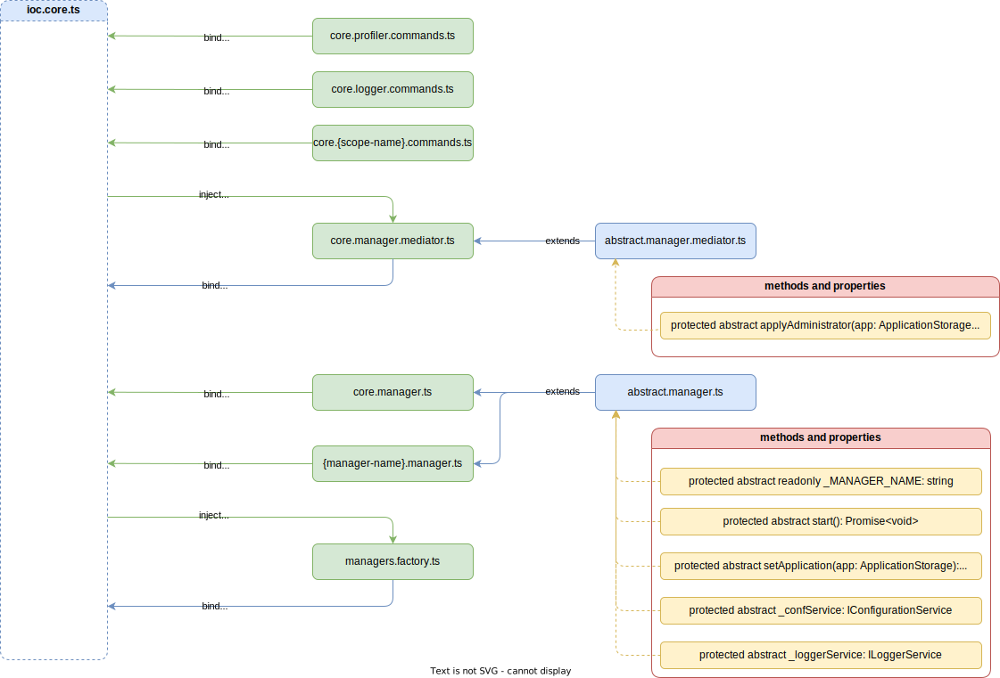

@@ -0,0 +1,72 @@
# Managers 

Менеджери `managers` являють собою API взаємодії з `command line interface (CLI)`. Кожний менеджер є простим HTTP сервером, який працює на окремому виділеному порту та складається з меню `menu` та команд `commands`, медіатора команд `mediator`, який виступає в ролі маршрутизатора команд.

Кожний менеджер надає лише API взаємодії, запуск, зміна конфігурації чи зупинка окремо виділеного менеджера керується фабрикою менеджерів `Manager Factory` на основі заданої конфгігурації.

Загальна структура:

```
.
├── app.ts
├── ...
├── managers
|   └── core
|   |    └── commands
|   |    |    └── auth.core.commands.ts
|   |    |    └── schema.core.commands.ts
|   |    |    └── logger.core.commands.ts
|   |    |    └── {commands-scope-name}.{manager-name}.commands.ts
|   |    └── common
|   |    |    └── commands-name.ts
|   |    └── core.manager.mediator.ts
|   |    └── core.manager.server.ts
|   └── {manager-name}
|   |    └── commands
|   |    |    └── {commands-scope-name}.{manager-name}.commands.ts
|   |    └── common
|   |    |    └── commands-name.ts
├── factories
|   └── ...
|   └── managers.factory.ts
|   └── {factory-name}.factory.ts
|   ...

```

> [!NOTE]
> Кожний менеджер є частиною серверного ядра і як модулі так і сам менеджер входять до контейнера інверсії залежностей серверного ядра.
> Менеджери можуть звертатись лише до системних абстракцій, які ніяк не можуть бути поєднані з бізнес-логікою, а отже не мають до неї доступу та не можуть на неї впливати.



## Core Manager

Менеджер ядра відповідає за керуванням функціоналу серверного ядра. Запроектований та задіяний таким чином, щоб керувати змінами в ядрі без перезавантаження основного процесу. 

При підключеня з `CLI` менеджер потребує авторизуватись, оскільки керувати конфігурацією сервера можуть тільки ті користувачі, які мають права на таке керування. При створені запитів до будь-якого API окрім авторизації сервер перевіряє токен доступу виходячи з якого вибудовується доступ до тих чи інших дій. 

### Послідовність меню

1. Меню системи. Щоб вибрати систему (під системою розглядається суціональна бізнес-логіка конкретного проекту) необхідно вказати:
    - `tag` - це `tag` сервера, який задається для кожного окремого екземпляра сервера, який вказується в конфігураційному файлі `server.json` за шляхом `server:tag`. 
    - `secret` - це секретне слово, яке вказується в конфігураційному файлі - `server.json` за шляхом `server:secret`.
2. Меню авторизації. Щоб авторизуватись необхідно вказати:
    - `login` - це `login` системного користувача, який був заведений в систему та дані про цього користувача наявні в базі даних застосунку "Системний адміністратор".
    - `password` - пароль системного користувача. 
3. Головне меню
 
Головне меню складається з:

| Елемент | Тип  Опис |
| :-----: | :--: | :--- |
| help | Команда | Надає деталі по роботі з усіма командами та меню |
| schema | Меню | Надає функціонал по роботі з бізнес-схемами |
| profiler | Меню | Надає функціонал по роботі з внутрішнім моніторингом сервера |
| logger | Меню | Надає функціонал по роботі з логуванням |
| conf | Меню | Надає функціонал по роботі з конфігураціями |
| exit | Команда | Вихід з системи та розлогування користувача |

4. Допоміжні меню:
    4.1. Меню `schema`
    Меню схем складається з:
    