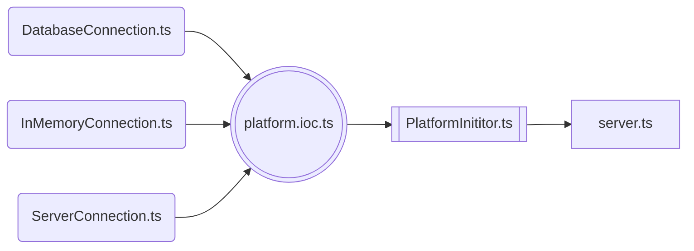

# Елементи системи

Найнижчий рівень платформи влаштований з послідовно підключених елементів системи.
В цій послідовності, при ініціалізації платформи, будуть запущені чи зупинені елементи системи.
Якщо елементи були вибудовані в одному порядку для їх ініціалізації, то відключення відбувається рівно в протилежному порядку. <br/><br/>
Елементами платформи на момент першого релізу є:
-  З’єднувач з базою даних `DatabaseConnection` – відповідає за запуск та закриття пулу з’єднань з базою даних.
-  З’єднувач з InMemory сховищем `InMemoryConnection` – відповідає за запуск та закриття з’єднання з InMemory сховищем.
-  З’єднувач з сервером `ServerConnection` – відповідає за запуск та зупинку сервера.

> [!INFO]
> Через потребу створення явного порядку – кожний з’єднувач успадковується від абстрактного з’єднувача, який потребує кожний з’єднувач реалізувати два методи – `start` та `stop`, таким чином, щоб в методі `start` була описана логіка запуску відповідного з’єднувача, а в методі `stop` – його зупинка.

**Cхема залежностей з'єднувачів, ініціалізатора платформи та точки входу:**



<br/>

> [!TIP]
> При потребі в розробці додаткових елементів системи - вони можуть бути включені в необхідний момент
> ініціалізація того, чи іншого, вже існуючого, елемента системи. Розуміючи необхідні залежності від інших елементів системи,
> додаткові елементи - будуть включені в таку послідовність, при якій всі залежності вже повинні бути проініціалізовані.


## З'єднувачі елементів системи

Найнижчий рівень серверної платформи влаштований з послідовно підключених елементів системи.
В цій послідовності, при ініціалізації платформи, будуть запущені чи зупинені елементи системи.
Якщо елементи були вибудовані в одному порядку для їх ініціалізації, то відключення відбувається рівно в протилежному порядку.

Елементами платформи на момент першого релізу є:
-  З’єднувач з базою данних `DatabaseConnection` – відповідає за запуск та закриття пулу з’єднань з базою данних.
-  З’єднувач з InMemory сховищем `InMemoryConnection` – відповідає за запуск та закриття з’єднання з InMemory сховищем.
-  З’єднувач з сервером `ServerConnection` – відповідає за запуск та зупинку сервера.

Через потребу створення явного порядку – кожний з’єднувач успадковується від абстрактного з’єднувача `AbstractConnection`,
потребує кожний з’єднувач реалізувати два методи – `start` та `stop`, таким чином, щоб в методі `start` була описана логіка
запуску відповідного з’єднувача, а в методі `stop` – його зупинка.

**Загальний вид абстрактного з'єднувача:**

```typescript
@injectable()
abstract class AbstractConnection implements IAbstractConnection {
    protected abstract loggerService: ILoggerService

    public abstract start(): Promise<void>
    public abstract stop(): Promise<void>
}

export default AbstractConnection
```

> [!TIP]
> При потребі створення нових з’єднувачів в майбутніх релізах – ці з’єднувачі будуть також успадковуватись
> від абстрактного з’єднувача та будуть реалізовувати методи запуску та зупинки цих з’єднувачів.

## З'єднувач з базою данних

Створення екземпляру конкретної бази данних відбувається завдяки фабрики баз даних `DatabaseFactory`.
Деталі реадіації фабрики описано в розділі ["Фабрики елементів платформи"](server-platform/).

Оскільки з’єднувач є точкою ініціалізації з’єднання з базою даних, то з’єднувач є компонентом найнижчого порядку,
тому він має метод, в який фабрика записує екземпляр конкретної бази даних, і вже цей екземпляр запускається чи зупиняється
в рамках з’єднувача. Наразі підтримуються тільки реляційні бази даних, але в наступному релізі буде створений функціонал для
роботи з нереляційною базою даних – MongoDB.

З’єднувач з базою даних запускається вже після того, як запуститься сервер з усіма залежностями. Оскільки для коректної
роботи фабрики бази даних, їй необхідний сервіс конфігурацій, який надається сервером, то екземпляр конкретної бази даних
створюється під час запуску сервера, це означає що готовий екземпляр вже буде створений до того, як настане черга запуску
з’єднувача з базою даних.