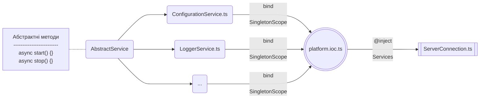

# Сервіси

Кожен сервіс визначається на основі потенційного суттєвого навантаження на конкретний функціонал.
Так, організація роботи з бібліотекою перекладів – це виклик одного й того ж метода,
який повертає той чи інший переклад в залежності від типу мови.
Організація ж логування при високих потребах в створені логів з великою деталізацією може зайняти весь
головний процес сервера, що унеможливлює його роботу при потребі обробки великої кількості запитів різним джерелам взаємодії.
Через це сервіс логування має можливість горизонтального масштабування - винесення логера в окремий вебсервер, який займається виключно написанням файлів з логами.
Іншою стороною медалі є постійна необхідність присутності екземпляра сервісу в оперативній пам’яті для постійного
звернення до нього, що, наприклад може бути здійснене з сервісом конфігурацій, через це тип створення екземплярів для сервісів відповідає Singleton scope.
Через те, що сервіси повинні бути запущені в конкретному порядку, кожен сервіс наслідує
від абстрактного сервісу два методи, один з яких відповідає за запуск, а інший за зупинку того чи іншого сервісу


Кожен сервіс, наслідуючись від абстрактного сервісу `AbstractService` повинен реалізувати хуки `onStart` та `onStop`, які
виконані при запуску чи відповідно зупинці сервісу. <br/>
Приклад сервісу конфігурації:

```typescript
@injectable()
class ConfigurationService extends AbstractService implements IConfigurationService {
    protected serviceName = 'ConfigurationService'
    protected logger: undefined

    constructor() {
        super()
    }

    protected onStart(): Promise<boolean> {
        return Promise.resolve(true);
    }

    protected async onStop(): Promise<void> {
        // not implemented
    }

    protected get<T extends string | number | boolean>(name: string, def?: string | number | boolean): string | number | boolean | undefined {
        try {
            const variable = config.get<T>(name)
            if (variable === '') {
                return def
            }
            return variable
        } catch (_) {
            return def
        }
    }

    // ...
}

export default ConfigurationService
```

Сервіси просуваються як залежності до з'єднувача сервера `ServerConnection`, де влаштовуються в необхідному порядку їх ініціалізації:

```typescript

@injectable()
class ServerConnection extends AbstractConnection implements IServerConnection {
    private _httpServer: http.Server | https.Server | undefined

    constructor(
        @inject(platformSymbols.ConfigurationService) private confService: IConfigurationService,
        @inject(platformSymbols.LoggerService) protected loggerService: ILoggerService,
        @inject(platformSymbols.DatabaseService) private dbService: IDatabaseService,
    ) {
        super();
    }

    private async startServices() {
        await this.confService.start()
        await this.loggerService.start()
        await this.dbService.start()
    }

    private async stopServices() {
        await this.dbService.stop()
        await this.loggerService.stop()
        await this.confService.stop()
    }
    
    // ...
}

export default ServerConnection
```

Таким чином загальна схема створення та підключення сервісів виглядає так:





# ConfigurationService

Сервіс конфігурацій `ConfigurationService` призначений для читання, обробки та надання конфігураційних змінних.

<hr/>

> [!NOTE]
> Для роботи сервісу необхідна бібліотека для роботи з конфігураційними змінними, тому сервіс завжди починає свою роботу першим.


Сервіс підтримує 3 рівні роботи з конфігураційними файлами:
- Конфігураційні файли NODE_ENV режиму роботи серверної платформи.
- Конфігураційні файли конкретної області призначення.
- Конфігураційні файли стороннього розміщення.

> [!WARNING]
> В файли конкретної області призначення рекомендується зазначити значення за замовчуванням, наприклад назви застосунку чи ін.
> В конфігураційні файли NODE_ENV режиму рекомендується зазначити значення за замовчуванням елементів системи, наприклад назви схем баз даних, порти протоколів або назв файлових сховищ.
> В конфігураційних файлах стороннього розміщення зазначити дійсні `production` або `development` значення змінних для роботи сервера, наприклад для `stage` хостингу - де буде розміщуватись застосунок на період закритого / відкритого Beta-тестування або для `production` для реального сервера що працює в робочому середовищі, який обробляє запити реальних користувачів.

Сервіс підтримує наступні типи даних та роботу з ними:
- Строкові дані.
- Числові дані.
- Бульові дані.
- Шляхи до сертифікатів (повинні мати абсолютні шляхи).
- Масиви об'єктів, де об'єкт складається з ключа змінною оточення та самої змінної.

## Система пріоритетів

Сервіс має систему пріоритетів, що дозволяє зазначити абстрактні, загальні значення відповідно до проєкту, зазначати значення для відповідного режиму роботи, та описувати приватні значення, які не повинні увійти до Git-репозиторію.

Значення прописане в файлі з більшим пріоритетом перебиває значення, яке прописане в файлі з меншим пріоритетом. Дійсне значення береться з файлу найвищого пріоритету, де це значення зазначено.

Список пріоритетів:

| Пріорітет | Опис                                                            |
|:---------:|:----------------------------------------------------------------|
|     1     | Значення, які прописані в файлах стороннього розміщення         |
|     2     | Значення, які прописані в файлах режиму роботи `NODE_ENV`       |
|     3     | Значення, які прописані в файлах конкретної області призначення |
|     4     | Значення, які прописані в ядрі серверної платформи              |

> ![ATTENTION]
> Вичитка та зміна конфігураційних файлів недоступна для використання, при написанні бізнес-логіки. При потребі змінних оточення або приватних змінних, при написанні бізнес-логіки - користуйтесь системної таблиці - системні опції - `SYS_ADMIN_SYSTEM_OPTIONS`.

## Системні опції

Сервісом надається наступний функціонал по роботі з системними опціями:
- Створення системної опції.
- Отримання однієї системної опції.
- Отримання всіх системних опцій застосунку.
- Зміна системної опції.
- Видалення системної опції.

### Модель даних

|            Ключ             |     Тип      | Обов'язковість | Особливості | Опис                                                                |
|:---------------------------:|:------------:|:--------------:|:-----------:|:--------------------------------------------------------------------|
| SYS_ADMIN_SYSTEM_OPTIONS_ID |     UUID     |      Так       | Primary key | Первинний ключ, є унікальним ідентифікатор запису в таблиці         |
|         APPLICATION         | varchar(255) |      Так       |      -      | Назва застосунку, до якого відноситься системна опція               |
|            TYPE             |   enum(1)    |      Так       |      -      | Тип опції: <br/> строкове - `S`. <br/> числове - `N`. бальове - `B` |
|             KEY             | varchar(255) |      Так       |    UNK1*    | Назва системної опції                                               |
|            VALUE            | varchar(255) |      Так       |      -      | Значення системної опції                                            |
|           DEFAULT           | varchar(255) |       Ні       |      -      | Значення системної опції за замовчуванням                           |

*UNK1 - `CHECK CONSTRAINT UNIQUE in ('APPLICATION', 'KEY')`

## Читання конфігураційних файлів

При ініціалізації модулів сервера з типом ініціалізації `Singleton` або `Request` модулі вичитують необхідні їм дані з відповідним, по пріоритету файлів.

Окремо сервіс підтримує можливість створити подію перечитати конфігураційні файли для зміни роботи конкретного `Singleton` модуля (Модулі з типом ініціалізації - `Transient` вичитують конфігураційні файли в момент створення екземпляра).

Функціонал перечитання конфігураційних файлів включений в [Manager CLI]()

## API

API по роботі з системними опціями користувача дивись [BusinessLogicAgent.conf]()


# LoggerService

Сервіси логів `LoggerService` призначений для створення та обробки журналів логування.

<hr/>

> [!NOTE]
> Для роботи сервісу необхідна робота з конфігураційними файлами, тому сервіс завжди повинен починати роботу після ініціалізації сервісу конфігурації `ConfigurationService`.

Сервіс логів підтримує наступні види логування:

| Рівень | Область призначення | Опис                                                                                                                     |
|:------:|:-------------------:|:-------------------------------------------------------------------------------------------------------------------------|
|   0    |        error        | Системні помилки та виключення, які генеруються в ході роботи обробників сервера                                         |
|   1    |        warn         | Попередження про коректні дані або рекомендації по коректності даних, які використовуються бізнес-логікою                |
|   2    |        info         | Фіксація етапів виконання конкретного обробника в рамках свого життєвого циклу                                           | 
|   3    |        http         | Фіксація виконання запитів до / від сервера з інформацією, яка повинна містити опис та статус виконання запиту           |
|   4    |       verbose       | Розгорнутий опис будь-якої необхідної події, яка не повинна при цьому містити персональних даних, бізнес-дані чи метрики |
|   5    |        debug        | Фіксація проміжних етапів. Використовувати лише при розробці програмного забезпечення                                    |
|   6    |         db          | Фіксація виключень та помилок, які відбулись при запитах до бази даних                                                   |
|   7    |       storage       | Фіксація виключень та помилок, які відбулись при запитах до сховища пам'яті `MemoryStorage`                              | 
|   8    |       system        | Фіксація роботи модулів сервера, їх ініціалізація, зупинка, перепідключення і т.д.                                       |

Сервіс логування підтримує наступний ряд транспортів:
- Вивід логів в консоль - `Console transport`.
- Вивід логів у файл - `File transport`.
- Вивід логів в `Logstash` з послідуючим їх зберіганням в `Elasticsearch` та відображенням в `Kibana`.

Сервіс логів використовує декілька логерів, як відповідають за наступне:
- `BusinessLogger` - виконує логування подій бізнес-логіки.
- `CoreLogger` - виконує логування подій, які відбулись в ядрі платформи.
- `ElasticLogger` - виконує логування як ядра, так і бізнес-логіки в `Logstash`.

Журнал логів, в залежності від вимог проєкту, може бути відображений:
- `Kibana` сервіс в `Elasticsearch` (для роботи необхідне логування через `Logstash`).
- Явною вичиткою файлу.
- Вичиткою завдяки `Manager CLI`. Деталі по реалізації описані в [Manager CLI]().
- Візуальним відображенням в застосунку `Системний адміністратор`.

## Конфігурація логера

### Logstash / Elasticsearch / Kibana

Для створення логування в ElasticSearch необхідно вказати в конфігураційних файлах.

## API

API по роботі з системними опціями користувача дивись [BusinessLogicAgent.logger]()

# CacheService

Сервіс кешування призначений для створення, обробки та видалення кешу з пам'яті сервера.

<hr/>

# cache

Сервіс кешування призначений для створення, обробки, валідації та видалення кешу.

<hr/>

## Зміст
- methods:
    - [cache.put]
    - [cache.get]
    - [cache.update]
    - [cache.delete]
    - [cache.validate]
    - [cache.revalidate]
    - [cache.checkResource]
    - [cache.checkData]
    - [cache.clear]

