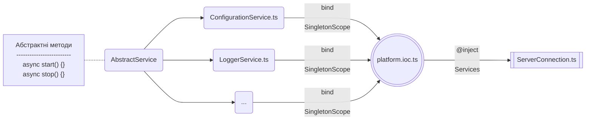

# Сервіси

Кожен сервіс визначається на основі потенційного суттєвого навантаження на конкретний функціонал.
Так, організація роботи з бібліотекою перекладів – це виклик одного й того ж метода,
який повертає той чи інший переклад в залежності від типу мови.
Організація ж логування при високих потребах в створені логів з великою деталізацією може зайняти весь
головний процес сервера, що унеможливлює його роботу при потребі обробки великої кількості запитів різним джерелам взаємодії.
Через це сервіс логування має можливість горизонтального масштабування - винесення логера в окремий вебсервер, який займається виключно написанням файлів з логами.
Іншою стороною медалі є постійна необхідність присутності екземпляра сервісу в оперативній пам’яті для постійного
звернення до нього, що, наприклад може бути здійснене з сервісом конфігурацій, через це тип створення екземплярів для сервісів відповідає Singleton scope.
Через те, що сервіси повинні бути запущені в конкретному порядку, кожен сервіс наслідує
від абстрактного сервісу два методи, один з яких відповідає за запуск, а інший за зупинку того чи іншого сервісу


Кожен сервіс, наслідуючись від абстрактного сервісу `AbstractService` повинен реалізувати хуки `onStart` та `onStop`, які
виконані при запуску чи відповідно зупинці сервісу. <br/>
Приклад сервісу конфігурації:

```typescript
@injectable()
class ConfigurationService extends AbstractService implements IConfigurationService {
    protected serviceName = 'ConfigurationService'
    protected logger: undefined

    constructor() {
        super()
    }

    protected onStart(): Promise<boolean> {
        return Promise.resolve(true);
    }

    protected async onStop(): Promise<void> {
        // not implemented
    }

    protected get<T extends string | number | boolean>(name: string, def?: string | number | boolean): string | number | boolean | undefined {
        try {
            const variable = config.get<T>(name)
            if (variable === '') {
                return def
            }
            return variable
        } catch (_) {
            return def
        }
    }

    // ...
}

export default ConfigurationService
```

Сервіси просуваються як залежності до з'єднувача сервера `ServerConnection`, де влаштовуються в необхідному порядку їх ініціалізації:

```typescript

@injectable()
class ServerConnection extends AbstractConnection implements IServerConnection {
    private _httpServer: http.Server | https.Server | undefined

    constructor(
        @inject(platformSymbols.ConfigurationService) private confService: IConfigurationService,
        @inject(platformSymbols.LoggerService) protected loggerService: ILoggerService,
        @inject(platformSymbols.DatabaseService) private dbService: IDatabaseService,
    ) {
        super();
    }

    private async startServices() {
        await this.confService.start()
        await this.loggerService.start()
        await this.dbService.start()
    }

    private async stopServices() {
        await this.dbService.stop()
        await this.loggerService.stop()
        await this.confService.stop()
    }
    
    // ...
}

export default ServerConnection
```

Таким чином загальна схема створення та підключення сервісів виглядає так:


