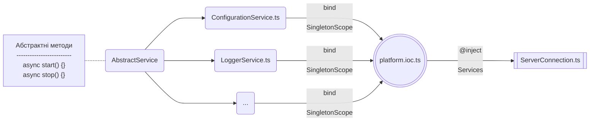

# Сервіси

Кожен сервіс визначається на основі потенційного суттєвого навантаження на конкретний функціонал.
Так, організація роботи з бібліотекою перекладів – це виклик одного й того ж метода,
який повертає той чи інший переклад в залежності від типу мови.
Організація ж логування при високих потребах в створені логів з великою деталізацією може зайняти весь
головний процес сервера, що унеможливлює його роботу при потребі обробки великої кількості запитів різним джерелам взаємодії.
Через це сервіс логування має можливість горизонтального масштабування - винесення логера в окремий вебсервер, який займається виключно написанням файлів з логами.
Іншою стороною медалі є постійна необхідність присутності екземпляра сервісу в оперативній пам’яті для постійного
звернення до нього, що, наприклад може бути здійснене з сервісом конфігурацій, через це тип створення екземплярів для сервісів відповідає Singleton scope.
Через те, що сервіси повинні бути запущені в конкретному порядку, кожен сервіс наслідує
від абстрактного сервісу два методи, один з яких відповідає за запуск, а інший за зупинку того чи іншого сервісу


Кожен сервіс, наслідуючись від абстрактного сервісу `AbstractService` повинен реалізувати хуки `onStart` та `onStop`, які
виконані при запуску чи відповідно зупинці сервісу. <br/>
Приклад сервісу конфігурації:

```typescript
@injectable()
class ConfigurationService extends AbstractService implements IConfigurationService {
    protected serviceName = 'ConfigurationService'
    protected logger: undefined

    constructor() {
        super()
    }

    protected onStart(): Promise<boolean> {
        return Promise.resolve(true);
    }

    protected async onStop(): Promise<void> {
        // not implemented
    }

    protected get<T extends string | number | boolean>(name: string, def?: string | number | boolean): string | number | boolean | undefined {
        try {
            const variable = config.get<T>(name)
            if (variable === '') {
                return def
            }
            return variable
        } catch (_) {
            return def
        }
    }

    // ...
}

export default ConfigurationService
```

Сервіси просуваються як залежності до з'єднувача сервера `ServerConnection`, де влаштовуються в необхідному порядку їх ініціалізації:

```typescript

@injectable()
class ServerConnection extends AbstractConnection implements IServerConnection {
    private _httpServer: http.Server | https.Server | undefined

    constructor(
        @inject(platformSymbols.ConfigurationService) private confService: IConfigurationService,
        @inject(platformSymbols.LoggerService) protected loggerService: ILoggerService,
        @inject(platformSymbols.DatabaseService) private dbService: IDatabaseService,
    ) {
        super();
    }

    private async startServices() {
        await this.confService.start()
        await this.loggerService.start()
        await this.dbService.start()
    }

    private async stopServices() {
        await this.dbService.stop()
        await this.loggerService.stop()
        await this.confService.stop()
    }
    
    // ...
}

export default ServerConnection
```

Таким чином загальна схема створення та підключення сервісів виглядає так:





# ConfigurationService

Сервіс конфігурацій `ConfigurationService` призначений для читання, обробки та надання конфігураційних змінних.

<hr/>

> [!NOTE]
> Для роботи сервісу необхідна бібліотека для роботи з конфігураційними змінними, тому сервіс завжди починає свою роботу першим.


Сервіс підтримує 3 рівні роботи з конфігураційними файлами:
- Конфігураційні файли NODE_ENV режиму роботи серверної платформи.
- Конфігураційні файли конкретної області призначення.
- Конфігураційні файли стороннього розміщення.

> [!WARNING]
> В файли конкретної області призначення рекомендується зазначити значення за замовчуванням, наприклад назви застосунку чи ін.
> В конфігураційні файли NODE_ENV режиму рекомендується зазначити значення за замовчуванням елементів системи, наприклад назви схем баз даних, порти протоколів або назв файлових сховищ.
> В конфігураційних файлах стороннього розміщення зазначити дійсні `production` або `development` значення змінних для роботи сервера, наприклад для `stage` хостингу - де буде розміщуватись застосунок на період закритого / відкритого Beta-тестування або для `production` для реального сервера що працює в робочому середовищі, який обробляє запити реальних користувачів.

Сервіс підтримує наступні типи даних та роботу з ними:
- Строкові дані.
- Числові дані.
- Бульові дані.
- Шляхи до сертифікатів (повинні мати абсолютні шляхи).
- Масиви об'єктів, де об'єкт складається з ключа змінною оточення та самої змінної.

## Система пріоритетів

Сервіс має систему пріоритетів, що дозволяє зазначити абстрактні, загальні значення відповідно до проєкту, зазначати значення для відповідного режиму роботи, та описувати приватні значення, які не повинні увійти до Git-репозиторію.

Значення прописане в файлі з більшим пріоритетом перебиває значення, яке прописане в файлі з меншим пріоритетом. Дійсне значення береться з файлу найвищого пріоритету, де це значення зазначено.

Список пріоритетів:

| Пріорітет | Опис                                                            |
|:---------:|:----------------------------------------------------------------|
|     1     | Значення, які прописані в файлах стороннього розміщення         |
|     2     | Значення, які прописані в файлах режиму роботи `NODE_ENV`       |
|     3     | Значення, які прописані в файлах конкретної області призначення |
|     4     | Значення, які прописані в ядрі серверної платформи              |

> ![ATTENTION]
> Вичитка та зміна конфігураційних файлів недоступна для використання, при написанні бізнес-логіки. При потребі змінних оточення або приватних змінних, при написанні бізнес-логіки - користуйтесь системної таблиці - системні опції - `SYS_ADMIN_SYSTEM_OPTIONS`.

## Системні опції

Сервісом надається наступний функціонал по роботі з системними опціями:
- Створення системної опції.
- Отримання однієї системної опції.
- Отримання всіх системних опцій застосунку.
- Зміна системної опції.
- Видалення системної опції.

### Модель даних

|            Ключ             |     Тип      | Обов'язковість | Особливості | Опис                                                                |
|:---------------------------:|:------------:|:--------------:|:-----------:|:--------------------------------------------------------------------|
| SYS_ADMIN_SYSTEM_OPTIONS_ID |     UUID     |      Так       | Primary key | Первинний ключ, є унікальним ідентифікатор запису в таблиці         |
|         APPLICATION         | varchar(255) |      Так       |      -      | Назва застосунку, до якого відноситься системна опція               |
|            TYPE             |   enum(1)    |      Так       |      -      | Тип опції: <br/> строкове - `S`. <br/> числове - `N`. бальове - `B` |
|             KEY             | varchar(255) |      Так       |    UNK1*    | Назва системної опції                                               |
|            VALUE            | varchar(255) |      Так       |      -      | Значення системної опції                                            |
|           DEFAULT           | varchar(255) |       Ні       |      -      | Значення системної опції за замовчуванням                           |

*UNK1 - `CHECK CONSTRAINT UNIQUE in ('APPLICATION', 'KEY')`

## Читання конфігураційних файлів

При ініціалізації модулів сервера з типом ініціалізації `Singleton` або `Request` модулі вичитують необхідні їм дані з відповідним, по пріоритету файлів.

Окремо сервіс підтримує можливість створити подію перечитати конфігураційні файли для зміни роботи конкретного `Singleton` модуля (Модулі з типом ініціалізації - `Transient` вичитують конфігураційні файли в момент створення екземпляра).

Функціонал перечитання конфігураційних файлів включений в [Manager CLI]()

## API

API по роботі з системними опціями користувача дивись [BusinessLogicAgent.conf]()


# LoggerService

Сервіси логів `LoggerService` призначений для створення та обробки журналів логування.

<hr/>

> [!NOTE]
> Для роботи сервісу необхідна робота з конфігураційними файлами, тому сервіс завжди повинен починати роботу після ініціалізації сервісу конфігурації `ConfigurationService`.

Сервіс логів підтримує наступні види логування:

| Рівень | Область призначення | Опис                                                                                                                     |
|:------:|:-------------------:|:-------------------------------------------------------------------------------------------------------------------------|
|   0    |        error        | Системні помилки та виключення, які генеруються в ході роботи обробників сервера                                         |
|   1    |        warn         | Попередження про коректні дані або рекомендації по коректності даних, які використовуються бізнес-логікою                |
|   2    |        info         | Фіксація етапів виконання конкретного обробника в рамках свого життєвого циклу                                           | 
|   3    |        http         | Фіксація виконання запитів до / від сервера з інформацією, яка повинна містити опис та статус виконання запиту           |
|   4    |       verbose       | Розгорнутий опис будь-якої необхідної події, яка не повинна при цьому містити персональних даних, бізнес-дані чи метрики |
|   5    |        debug        | Фіксація проміжних етапів. Використовувати лише при розробці програмного забезпечення                                    |
|   6    |         db          | Фіксація виключень та помилок, які відбулись при запитах до бази даних                                                   |
|   7    |       storage       | Фіксація виключень та помилок, які відбулись при запитах до сховища пам'яті `MemoryStorage`                              | 
|   8    |       system        | Фіксація роботи модулів сервера, їх ініціалізація, зупинка, перепідключення і т.д.                                       |

Сервіс логування підтримує наступний ряд транспортів:
- Вивід логів в консоль - `Console transport`.
- Вивід логів у файл - `File transport`.
- Вивід логів в `Logstash` з послідуючим їх зберіганням в `Elasticsearch` та відображенням в `Kibana`.

Сервіс логів використовує декілька логерів, як відповідають за наступне:
- `BusinessLogger` - виконує логування подій бізнес-логіки.
- `CoreLogger` - виконує логування подій, які відбулись в ядрі платформи.
- `ElasticLogger` - виконує логування як ядра, так і бізнес-логіки в `Logstash`.

Журнал логів, в залежності від вимог проєкту, може бути відображений:
- `Kibana` сервіс в `Elasticsearch` (для роботи необхідне логування через `Logstash`).
- Явною вичиткою файлу.
- Вичиткою завдяки `Manager CLI`. Деталі по реалізації описані в [Manager CLI]().
- Візуальним відображенням в застосунку `Системний адміністратор`.

## Конфігурація логера

### Logstash / Elasticsearch / Kibana

Для створення логування в ElasticSearch необхідно вказати в конфігураційних файлах.

## API

API по роботі з системними опціями користувача дивись [BusinessLogicAgent.logger]()

# CacheService

Сервіс кешування призначений для створення, обробки та видалення кешу з пам'яті сервера.

<hr/>

# cache

Сервіс кешування призначений для створення, обробки, валідації та видалення кешу.

<hr/>

## Зміст
- methods:
    - [cache.put]
    - [cache.get]
    - [cache.update]
    - [cache.delete]
    - [cache.validate]
    - [cache.revalidate]
    - [cache.checkResource]
    - [cache.checkData]
    - [cache.clear]

# SessionService

Сервіс сессій призначений для створення, моніторингу, обробки та видалення сессій користувачів системи. 

Для роботи сервіса необхідні:
- Зміні оточення, які надаються конфігураційними файлами.
- Функціонал логування.
- Сформований та під'єднаний об'єкт бізнес-логіки.

Отже сервіс ініціалізовується після ініціалізації відповідних сервісів обробки вище описанного функціоналу.

## HTTP та Websocket сесії

Сервер підтримує HTTP та Websocket сессії. 

> [!WARNING]
> Ркомендується створювати як HTTP так і WebSocket сесію для більш еффективної взаємодії між сервером та веб-клієнтом.

Сесії користувачів знаходяться в окремому `Memory storage`, який використовує `Redis` сховище. В випадку підняття декількох екземплярів сервера, це надає можливість як взаємодії так і міграцій сессій користувачів між серверами. 

При використанні Websocket протоколу платформа підтримує розподілене навантаження:
- `ws` з'єднання не авторизованих користувачів зберігаються на рівні `ws` протоколу.
- `ws` з'єднання авторизованих користувачів зберігається в пам'яті сервера в `Map` колекції.
- Сессія авторизованого користувача зберігається в `memory storage` - `Redis` сховищі.
- Унікальний ідентифікатор сессії генерується в момент авторизації користувача, зберігається та передається завдяки токенам доступу `access token` та токену оновлення `refresh token`.

Це створює децентралізовану систему управління з'єднаннями, оскільки відповідний процес роботи з з'єднанням чи сессії обробляється на своєму рівні. Така система управління створює суттєве зменшення навантаження на базу даних, оскільки звернення до неї відбувається лише при авторизації користувача в системі або його виходу з цієї ж системи (або виходу з систему на іншому джерелі взаємодії).

## Міграція сессій

Оскільки кожний веб-клієнт повинен при авторизації передавати свій унікальний ідентифактор клієнту - тег `client tag`, а кожний екземляр сервера має свій унікальний ідентифатор екземлпяра tag - `server tag`, то кожна сессія користувача має включає ці теги. 

### Міграція сессій між клієнтами

Якщо до сервера підключені декілька різних джерел взаємодії, наприклад десктопний застосунок, мобільний застосунок та веб-клієнт, то кожних з цим джерел має свій унікальний ідентифікатор клієнта - тег, про який знає сервер. 

Таким чином може бути створений:
- `broadcast` для цих джерел, наприклад дія створеня повідомлення, яке прийде на всі типи джерел. 
- Міграція сессії користувача між джерелами взаємодії, шляхом зміни тегу клієнта в сессії користувача.
- Інший потенційний функціонал для взаємодії сессії між джерелами взаємодії.

При міграції авторизованої сессії - сессія користувача повинна містити унікальний ідентифікатор девайсу. Таким чином різні джерела взаємодії зможуть завдяки унікальним даним сессії ідентифікувати її профіль та надати кінцевому користувачеві доступ.

### Міграція сессій між серверами

Якщо є потреба в декількох екземплярах одного сервер застосунку, а кожний з цих екземплярів оперує своїми сессіями користувачів, наприклад, при розміщені екземплярів в різних регіонах однієї країни, то кожний з цих екземплярів містить унікальний ідентифатор - тег `server tag`. 

Завдяки тому, що самі сессії знаходяться в `memory storage` - `Redis` сховищі, то кожний з екземплярів під'єднаний до цього сховищ. Таким чином міграція сессії між серверами відбувається зміною тега `server tag` у відповідної сессії або сессій.

Таким чином може бути суттєво зменшене навантаження на окремі екземпяри серверів, в випадку, якщо один в данний момент опрацьовує 100 000 авторизованих користувачів, а інший екземпляр сервер-застосунку 10 000 авторизованих користувачів. Побічною дією для конкретного авторизованного користувача є несуттєве зменшення пропускної здатності але як покаує світова практика, використання веб-ресурсів, які розташовані на великів відстані не призводить до суттєвого зменшення якості досвіду взаємодії кінцевого користувача з цим веб-ресурсом.

## HTTP Авторизація

Авторизація HTTP сесії відбувається наступним чином:
1. Користувач веб-клієнту вносить дані:
    - Логін / Електронну пошту / Номер телефону тощо.
    - Пароль
2. Клієнт надсилає дані авторизації до відповідного ендпоїнту на сервері.
3. Сервер в рамках обробника ендпоїнту авторизації:
    - Знаходить профіль користувача або повертає помилку. що такого користувача не знайдено.
    - Перевіряє пароль у знайденого профіля з веденим паролем, та повертає помилку в разі невірного пароля.
    - Створює сесію користувача в сховищі пам'яті `Memory storage` , ключ якої - випадкова генерація унікального ідентифікатора за типом v4, та значенням об'єкту, який складається з:
        - Даних про профіль користувача, які будуть вказані в бізнес-логіці.
        - Тегу сервера, на якому була створена сессія.
    - Генерація токена доступу `access token` та  токена оновлення `refresh token`, в `payload` яких входить унікальний ідентифікатор сессії.
    - Повернення на веб-клієнт в полях `headers` наступних полів:
        - В заголовці `x-access-token` - токен доступу `access token`.
        - В заголовці `x-refresh-token` - токен оновлення `refresh token`.
4. Веб-клієнт розшифровує `x-access-token` та отримує значення унікального ідентифікатора HTTP сесії користувача, якку зберігає в `local storage`.

## Websocket Авторизація

Авторизація Websocket сессії відбувається наступних чином:
1. При відкриті головної сторінки веб-клієнту користувачем, веб-клієнт створює з сервером `handshake`. 
2. Сервер генерує унікальний ідентифікатор з'єднання `socketId` та записує в коллекцію `Map` (яка записує дані в пам'ять сервера) об'єкт, де ключ це `socketId`, а значення - саме з'єднання `websocket connection`.
3. Оскільки явна авторизація користувача на сервері відбувається завдяки HTTP авторизації, то Websocket авторизація може бути виконана відразу після HTTP авторизації.
В результаті успішної HTTP авторизації веб-клієнт отримує наступні дані:
    - В заголовці `x-access-token` - токен доступу `access token`.
    - В заголовці `x-refresh-token` - токен оновлення `refresh token`.
При розшифруванні `x-access-token` веб-клієнт отримує унікальний ідентифікатор сессії користувача.
4. Веб-клієнт створює події з назвою `client:session:open`, та надає наступні дані:
    - Унікальний ідентифікатор сессії користувача.
    - Тег клієнта.
    - Мова локалізації.
5. Сервер слухаючи подію з назвою `client:session:open` здійснює наступні дії:
    - Знаходить з'єднання `websocket connection` в коллекції з'єднань по унікальному ідентифікатору `socketId`, який прикріплений до кожного з'єднання при `handshake`. 
    - Створює пошук сесії в сховищі пам'яті `memory storage` завдяки унікальному ідентифактору сессії користувача.
    - Здійснює перевірку поля `socketId` в об'єкті сессії користувача по `socketId`, якщо він інший, то перезаписує його, та викликає `terminate` для видалення з'єднання з минулим `socketId`.
    - Дозаписує до сесії користувача слідуючі поля:
        - Тег клієнта.
        - Мова локалізації.
        - `socketId` (якщо таке поле пусте або відрізняється).

Websocket взаємодія поділяється на системні дії та дії бізнес-логіки. Таке розділення зумовлене тим, що оперування з'єднаннями `websocket` протоколу потребує як регулятивних та моніторингових задач по коректності самих з'єднань так і реалізації прикладних задач бізнес-логіки по взаємодії між серером, веб-клієнтами чи застосунками. Таким чином системні дії виконуються ядром серверної платформи, а прикладні дії створюються бізнес-логікою.

### Системні дії

Системні дії поділяються на обробку з'єднань та обробку подій бізнес-логіки. 

#### Обробка з'єднаннь

Websocket з'єднання надає можливість постійного двухстороннього обміну між сервером та клієнтом. Це зумовлює ряд задач для яких необхідно здійснювати моніторинг та оркестризацію.

Моніторинг `websocket` з'єднань полягає в:
- Ліквідацію з'єднань, які зникли в ході перезавантаження сторінки.
- Перевірки з'єднань, які можуть потенційно зникнути та створити нове з'єднання в зв'язку з поганим інтернетом, зміною зони роздавання інтернету та ін.
- Заміна ідентифікатора з'єднань у діючих сессій з послідуючим видаленням недіючих з'єднань.

Окрестризація `websocket` з'єднань полягає в:
- Створення трансляцій `broadcast` серед з'єднань з неавторизованними сессіями.
- Зв'язування та підтримка `websocket` з'єднань з авторизованими сессіями.

Таким чином обробка з'єднань надає стабільність взаємодії між постійними змінними - сессіями користувачів та їх належності в рамках сервера та клієнта.

#### Обробка подій бізнес-логіки

Загалом потенційно створені типи подій бізнес-логіки можуть бути поділена на ряд областей призначень `scope`. Такими областями призначення є:

| Тип події | Опис |
| :-------: | :---- |
| `session:open` | Створення авторизованої конкретної сессії користувача |
| `session:get` | Отримати інформацію про авторизовану сессію користувача |
| `session:destroy` | Видалити конкретної сессії користувача |
| `session:sent:to:all` | Створення трансляції `broadcast` конкретної сессії на рівень всіх застосунків |
| `session:sent:to:room` |  Створення трансляції `broadcast` конкретної сессії на рівні конкретної кімнати |
| `session:send:to:session` | Відправка події від конкретної сессії до конкретної сессії |
| `room:create` | Створення приватної кімнати спілкування сессій |
| `room:add:session` | Додавання конкретної сессії до конкретної приватної кімнати |
| `room:get:session:specific` | Отримання конкретної сессії конкретної приватної кімнати |
| `room:get:session:all` | Отримання всіх сессій конкретної приватної кімнати |
| `room:remove:session` | Видалення конкретної сессії з кокретної приватної кімнати |
| `room:destroy` | Видалення приватної кімнати |


> [!WARNING]
> Платформою зарезрвовані вище описаний ряд типів подій, але з'єднання для спілкування відбувається з доповненням системного протоколу взаємодії між серверним та клієнтским ядрами, тому якщо подія прикладної логіки матиме таку ж назву це не створить колізій в системі.

Таким чином кожна подія бізнес-логіка використує відповідний тип події описаний в таблиці, та вже на базі нього формує свою подію бізнес-логіки. Завдяки такій дворівневій системі визначення подій створюється можливість їх систематизувати та винести в бізнес-логіку високорівневий контракт описання конкретної події під конкретним тип її направлення, наприклад надіслати конкретному користувачу, кімнаті чи застосунку або навпаки - прийняті від конкретного слухача, кімнати і т.д. 

> [!TIP]
> При потребі створення нових, абстрактних типів подій, вони додаються як новий метод типів подій ссессійного сервіса з послідуючим приєднанням цього методу в агент бізнес-логіки `BusinessLogicAgent`.

### Прикладні дії

Під кожний тип системних подій обробки бізнес-логіки сервіс підтримує відповідний метод. В рамках конкрентого методу він ідентифікує з'єднання сессії користувача, та створює прослуховування чи відправка подій, яка задана бізнес-логікою. Контракт кожного такого метода має 3 обов'язкових аргумента:
- Унікальний ідентифікатор сессії (надається з `payload` токену доступу `acess-token` клієнтом).
- Назва події (задається при описі бізнес-логіки).
- Дані події (задається при описі бізнес-логіки).

Таким чином при створені подій бізнес-логіки - ці події в рамках бізнес-логіки є уніфікованими, що суттєво спрощує написання її написання.

Прикладні дії просунуті в об'єкт `sessions` в агента бізнес-логіки `BusinessLogicAgent`.

