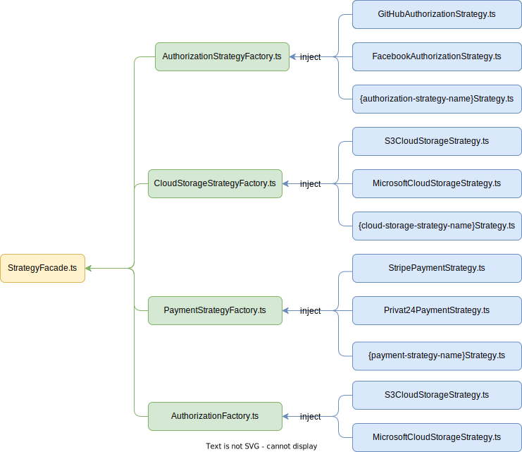

# Strategies 

Шаблон проектування стратегія `strategy` передбачає створення схожих варіантів вирішення однієї і тіє ї проблеми. Кожна стратегія серверного ядра описує конкретним тип вирішення проблеми відповідної області проблеми.

## Cloud storage strategies

Стратегії хмарних сховищ призначені для реалізації функціональності по зберігання та відвантаженю масивних файлів, наприклад фотографій, відео, PDF файлів чи ін. 

Кожна стратегія на данний момент реалізовує наступні методи:
- `upload` - додавання файлу.
- `uploadMultipart` - додавання декількох файлів.
- `replace` - заміна одного файлу на інший з зберіганням того ж посилання.
- `remove` - видалення файлу.
- `download` - відвантаження файлу.

### Завантаження та відвантаження файлів

Для роботи з файлами серверне ядро використовує пакет [busboy](https://www.npmjs.com/package/busboy). Оскільки кожна стратегія хмарних сховищ передбачає можливість отримання файлів в форматі потоку даних, а бібліотека [busboy](https://www.npmjs.com/package/busboy) надає змогу відразу передавати поток даних з вхідного запиту, то при завантажені та відвантажені файлів оперативна пам'ять сервера не займається даними файлів, а отже і не навантажує саме серверне ядро, таким чином також суттєво збільшується продуктивність роботи сервера.

### Попередня обробка файлів

Серверне ядро підтримує попередню обробку файлів перед тим, як завантажити чи відвантажити файлів. Наразі пітримується лише попередня обробка зображень. Попередня обробка здійснюється завдяки бібліотеці [sharp](https://www.npmjs.com/package/sharp), яка має продуктивність вище в 4-5 рази ніж її аналоги. 

### Стратегії та області вирішення

| Назва стратегії | Назва модуля | Опис | 
| :-------------: | :----------: |  :--- | 
| AWS S3 | s3.cloud-storage.strategy.ts| Описує методи роботи з хмарним сховищем [AWS S3](https://www.npmjs.com/package/@aws-sdk/client-s3) |  
| Google Cloud Storage | google.cloud-storage.strategy.ts | Описує методи роботи з хмарним сховищем [Google Cloud Storage](https://www.npmjs.com/package/@google-cloud/storage) | 
| Microsoft Azure Storage | azure.cloud-storage.strategy.ts |  Описує методи роботи з хмарним сховищем [Microsoft Asuze Storage](https://www.npmjs.com/package/@azure/storage-blob) | 

За підключення чи відключення конкретного клієнта сервісу хмарного сховища відповідає хмарна фабрика `CloudStorageFactory`. Оскільки кількість фабрик відповідних стратегій може бути суттєва кількість, та не в кожному проекті буде потреба в тій чи іншій фабриці та відповідно в тій чи іншій стратегії, то робота з фабрика організована на рівні фасаду стратегій `StrategyFacade`.  

> [!TIP] 
> Кожна стратегія наслідується від абстрактної стратегії хмарного сховища `abstract.cloud-storage.strategy.ts`, таким чином створюється:
> - імперативність створення нових стратегій
> - при потребі додавання чи зміни методів стратегії хмарного сховища - ці методи повинні будуть додані во всі стратегії.
> Завдяки цьому створюється надійність підтримки та розвитку стратегій, оскільки унеможливлює помилки розробника при впроваджені нововедень.